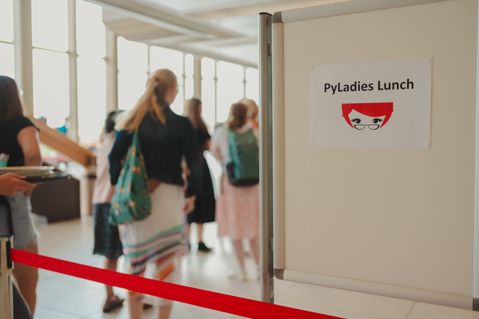
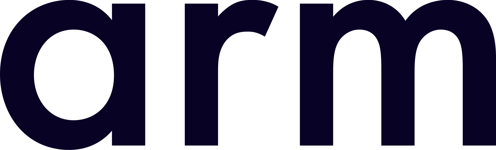

# PyLadies Activities

We’re excited to announce a range of events for underrepresented groups in
computing this year! 🎉 Whether you're new to PyLadies or a long-time supporter,
we warmly welcome you to join us and be part of our supportive community.

These events are open only to those who have a conference ticket, giving our
attendees an exclusive opportunity to connect, share, and grow together.

## PyLadies Booth

International mentorship group with a focus on helping more women, non-binary
people and minorities become active participants and leaders in the Python
open-source community.

Come to visit us and learn more about the initiative and how you can support us!

- **Location:** Community area (Ground Floor)
- **Time:** Wednesday 15th – Friday 17th

## PyLadies Workshops

Discover the exciting workshops offered at this year's PyLadies events!

Each session is designed to provide valuable skills, knowledge, and insights for
underrepresented groups. Join our expert instructors as they guide you through
interactive activities, hands-on exercises, and engaging discussions that will
help you expand your expertise.

Don't miss this unique opportunity to learn from and connect with like-minded
individuals and communities dedicated to advancing diversity and inclusion in
technology and Python development.

### Create your own musical instrument with custom gesture control
This will be a hands-on workshop during which we will build a digital musical instrument controlled by personalised gestures.

We will make a standalone desktop application with a web UI which embeds an existing machine learning model for timbre transfer. We will look at an example of a meaningful control of the model for creative use in interactive, real-time sound generation.

Finally, we will use interactive machine learning to define a personalised way of controlling the instrument based on a few examples provided on the fly.

- **Location:** Glass Room (Ground Floor)
- **Time:** Thursday 16th of July
- **Speaker:** [Anna Wszeborowska](https://ep2026.europython.eu/speaker/anna-wszeborowska/)
- **View in the schedule:** https://ep2026.europython.eu/session/create-your-own-musical-instrument-with-custom-gesture-control

### Leading Under Pressure
Teams are getting leaner, context switching is constant, and expectations stay high even when clarity is low. Under that pressure, many of us start reacting instead of leading: stepping in too often, firefighting instead of thinking, and quietly carrying load that was never ours to hold.

You do not need a title for any of this to apply. Leadership shows up in how you respond when things get tense, how you support the people around you, and where you choose to spend your finite energy.

This workshop is a space to notice what pressure does to your leadership, and to practise doing something different.

- **Location:** Glass Room (Ground Floor)
- **Time:** Thursday 16th of July
- **Speaker:** [Tereza Iofciu](https://ep2026.europython.eu/speaker/tereza-iofciu/)
- **View in the schedule:** https://ep2026.europython.eu/session/leading-under-pressure

## PyLadies Lunch

Join us for a special lunch event aimed at fostering community and empowerment
in tech. Enjoy meaningful conversations and networking opportunities.

- **Location:** Red Carpet (Second Floor)
- **Time:** Thursday 16th of July at 13:20

### Lunch generously provided by:
 

 

## PyLadies Organizer Open Space

During this one-hour PyLadies Open Space session, we invite PyLadies organizers
and allies to join a thoughtful and engaging dialogue.

The aim of this session is to discuss the current status of our individual
PyLadies communities, identify shared challenges, and explore the potential
benefits of increased collaboration between different PyLadies groups.

Through open and inclusive conversations, we hope to build stronger connections,
foster mutual growth, and create opportunities for collective impact within our
diverse PyLadies network.

- **Location:** TBD
- **Time:** TBD

## FAQs

<Accordion title="What are PyLadies?" id="what-are-pyladies">

PyLadies is a global community that supports underrepresented groups in Python.
We run events, workshops, and initiatives to make the ecosystem more inclusive.
</Accordion>

<Accordion title="What can I support at the PyLadies booth?" id="support-booth">

Volunteers are always welcome! Here's what you can help with:

- Greeting visitors and answering questions about PyLadies
- Sharing info about upcoming events, workshops, and initiatives
- Supporting PyLadies activities at EuroPython
</Accordion>

<Accordion title="How do I sign up to volunteer?" id="volunteer-signup">

The volunteer sign-up link will be shared here soon. In the meantime, you can
reach out to us at [helpdesk@europython.eu](mailto:helpdesk@europython.eu).
</Accordion>
