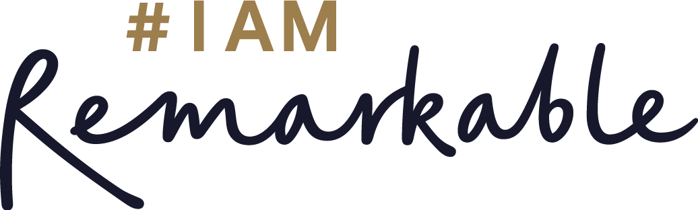

# PyLadies Events

We’re excited to announce a range of events for underrepresented groups in
computing this year! 🎉 Whether you're new to PyLadies or a long-time supporter,
we warmly welcome you to join us and be part of our supportive community.

These events are open only to those who have a conference ticket, giving our
attendees an exclusive opportunity to connect, share, and grow together.

## PyLadies Lunch

Join us for a special lunch event aimed at fostering community and empowerment
in tech. Enjoy meaningful conversations and networking opportunities.

- **When:** Thursday, 17th July 2025, 13:00 to 14:00.
- **Where:** Prague Congress Centre (PCC), VIP lunch area.

<Button url="https://forms.gle/ts9ryAQj8ieh36NB7">Register for the PyLadies Lunch</Button>

## PyLadies Open Space

During this one-hour PyLadies Open Space session, we invite Pyladies organizers,
members, newcomers, and allies to join a thoughtful and engaging dialogue.

The aim of this session is to discuss the current status of our individual
PyLadies communities, identify shared challenges, and explore the potential
benefits of increased collaboration between different PyLadies groups.

Through open and inclusive conversations, we hope to build stronger connections,
foster mutual growth, and create opportunities for collective impact within our
diverse PyLadies network.

- **When:** Thursday, 17th July 2025, 12:00 to 13:00.
- **Where:** Prague Congress Centre (PCC), VIP lunch area.

## #IAmRemarkable

Empower yourself in this workshop designed to help you celebrate your
achievements and improve your self-promotion skills.

- **When:** Thursday, 17th July 2025, 14:00 to 16:00.
- **Where:** Prague Congress Centre (PCC), Open Space 2 (Room 221+222)
- **Host:** Daria Linhart Grudzien

<Button url="https://forms.gle/6UEbDiHvTZGVkGWM9">Register for IAmRemarkable</Button>

## Stretching Session

Join us for an interactive Stretch Activity at the Europython.

- **When:** Thursday, 17th July 2025, 16:00 to 16:30
- **Where:** Prague Congress Centre (PCC), Open Space 2 (Room 223+224)

## PyLadies and PyLadiesCon Booth

International mentorship group with a focus on helping more women, non-binary
people and minorities become active participants and leaders in the Python
open-source community.

- **When:** From 16th, 17th and 18th of July 2025
- **Where:** Prague Congress Centre (PCC)
- **Registration:** TBD
