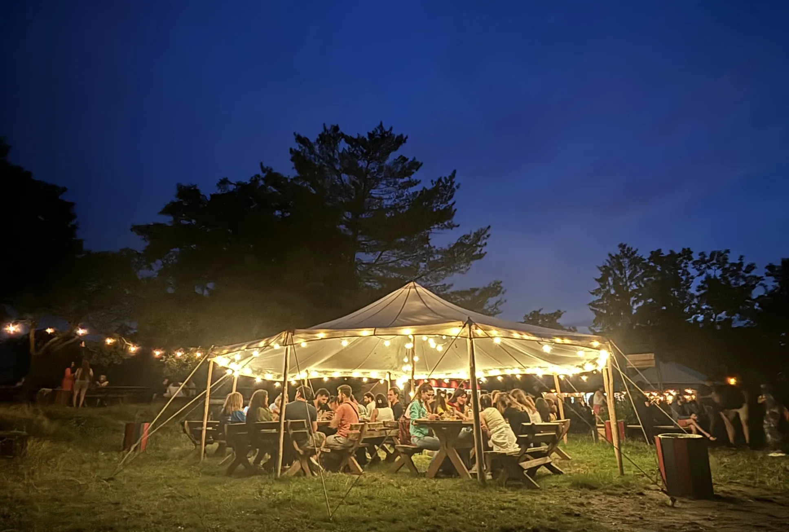

## About Pyvo
“Pivo” means beer in Czech—and Pyvo is a casual meetup for Python enthusiasts and fans of related technologies that happen in cities across the country. In Prague, Pyvo usually takes place every third Wednesday of the month. And this July, it’s happening during EuroPython!

## Pyvo @ EuroPython
Come join us for a special summer edition of Pyvo in Prague! We’re hosting a relaxed **grill & chill** where you can meet the local Python community and enjoy the summer vibes!

## Where and When?

* 🗓️ Date: Wednesday, 16 July 2025, starting at 18:30
* 📍 Location: [beer garden Na Hradbách](https://www.google.com/maps/place/Na+Hradb%C3%A1ch/@50.0636012,14.4194329,488m/data=!3m2!1e3!4b1!4m6!3m5!1s0x470b950f8b5821c1:0xedde8ade9cc53dcc!8m2!3d50.0636012!4d14.4220078!16s%2Fg%2F11kjyc47st?hl=en&entry=ttu&g_ep=EgoyMDI1MDcwOS4wIKXMDSoASAFQAw%3D%3D) — just a 10-minute walk from the Prague Congress Centre
* 💸 Price: free to attend
* 🍴 Food will be provided, including vegan, vegetarian, and gluten-free options — and you’re welcome to order more from the grill if you'd like

Address: [V Pevnosti, 128 00 Praha 2-Vyšehrad, Czechia](https://www.google.com/maps/place/Na+Hradb%C3%A1ch/@50.0636012,14.4194329,488m/data=!3m2!1e3!4b1!4m6!3m5!1s0x470b950f8b5821c1:0xedde8ade9cc53dcc!8m2!3d50.0636012!4d14.4220078!16s%2Fg%2F11kjyc47st?hl=en&entry=ttu&g_ep=EgoyMDI1MDcwOS4wIKXMDSoASAFQAw%3D%3D)

## Accessibility
The venue is an old style beer garden, so most of the seating is outdoors and the floor is uneven grass. (Wheelchair users may find it challenging, but should be fine. Users of other mobility aids should take special care.)
Outdoor seating is on benches and tables, which may not be suitable for everyone.

If you have any specific accessibility needs, please let us know in advance so we can do our best to accommodate you.

### Rain
This year's weather is a bit unpredictable. In case of rain the beer garden does have a large tent that can accommodate everyone, so we can continue the event without any issues.

## Special Guests
### PyLadies
PyLadies is a global mentorship group supporting women in becoming active contributors and leaders in the Python open-source world. This is a great chance to connect with fellow women in tech, grow your network, and share your stories.

### Django Software Foundation
Did you know Django turns 20 this year? Come celebrate with us—there’ll be drinks, good vibes, and a cake!

