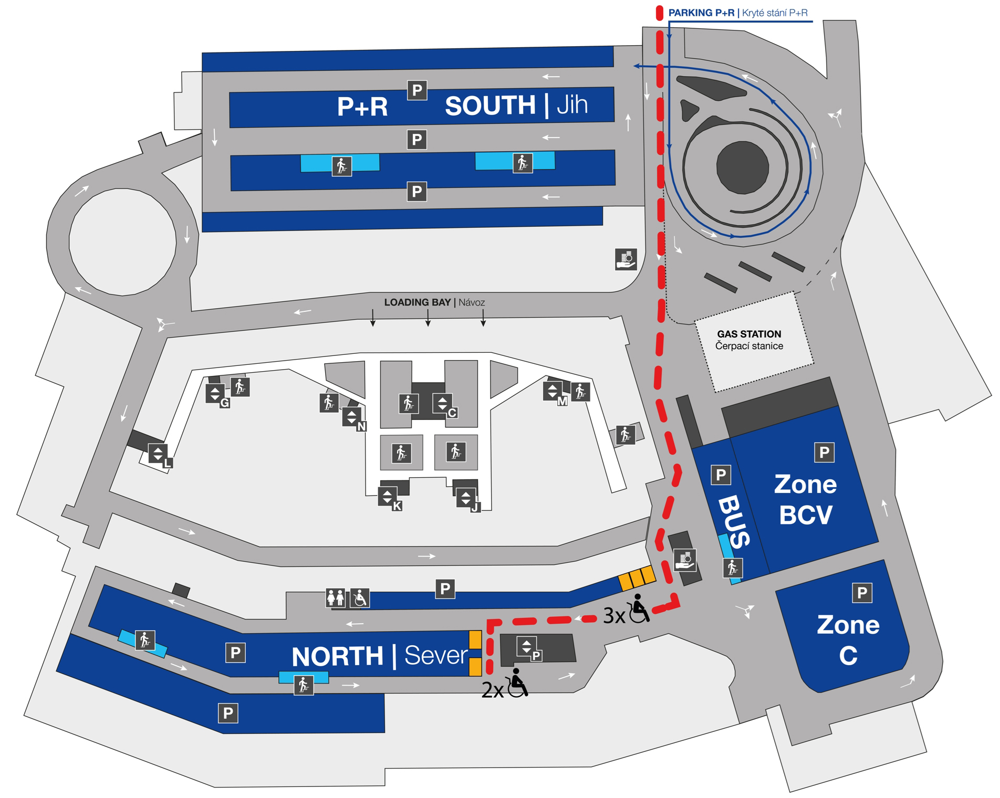
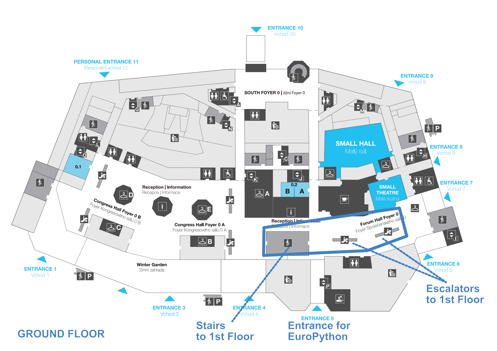
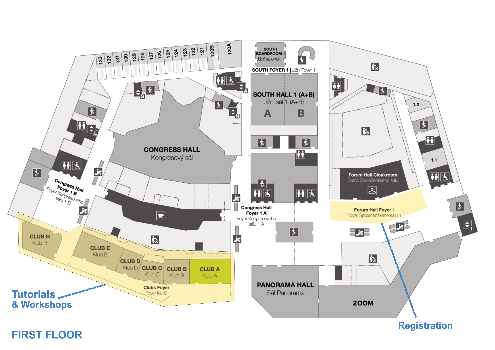
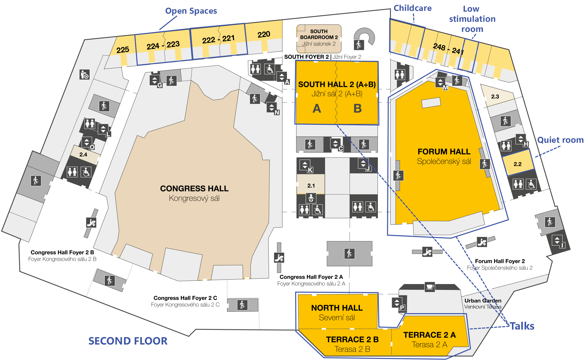

# Accessibility at EuroPython

EuroPython strives to be welcoming, accessible and inclusive for all our
guests attending the conference.
If you have suggestions to improve accessibility, please let us know by contacting us at
[helpdesk@europython.eu](mailto:helpdesk@europython.eu).

## General

You're very welcome to ask about any accessibility needs. These may include, for example:

- Dietary requirements
- Childcare
- Lifts
- Designated seating
- Help finding your way around the venue
- Special rooms for quiet time
- Accessible toilet facilities
- Other needs that pop up during the conference
- ...

**Before the conference**, you can leave us a note when ordering your tickets or contact us via email at helpdesk@europython.eu.

**During the conference**, you can visit our Info Desk at registration or speak with our volunteers wearing a yellow conference t-shirt. Registred ticket holders can also reach out via the Discord using the "support" channel – please bear with us if takes a moment to respond.

If you need help for things like designated seating, maintaining clear pathways, or anything else, feel free to speak to the volunteer coordinating the session in the talk rooms as well.

### Dietary Requirements

We aim to meet all dietary requirements specified during ticket registration.

Menus and related dietary information will be displayed each day to help you identify
suitable options. We will also have a dedicated dietary station at the bar area on the
second-floor foyer. If you are coeliac, or need to avoid any particular
allergen, please come to the dietary station for food.

### Neurodiversity bag

We understand that some conference participants can feel overwhelmed by large crowds. To help with this, we've prepared a bag full of squishy and plushy items for you to relax during the demanding conference days.
- Location: The bag is placed at the Info Desk in the Registration area.

- Contents: The bag contains various items, including fidget toys, squishy toys, and pop-it toys.
- Usage: Feel free to play and stim with anything you like for as long as you need. We kindly ask that you bring the items back so others can enjoy them as well.

### Childcare

Free childminding is available for attendees during the main conference (Monday-Friday). You can request this free
onsite service when you register your [ticket](https://ep2025.europython.eu/tickets). If you have questions, please
contact helpdesk@europython.eu.

- Childcare is on the **2nd floor** at **South Room 247 + 248**.
For full details, please visit the [childcare page](/childcare).

#### Feeding your child

There are **no restrictions on where you can breastfeed your child** – you are free and welcome
to feed your young ones at any place you feel comfortable.

Please note that only the conference venue (the Prague Congress Centre) has dedicated childcare rooms. If you prefer you can use these rooms to feed your child.  But – as stated above – you are not required to do so.

## Conference venue (Monday–Friday)
The Prague Congress Centre (PCC) is the main venue for EuroPython 2025.

### Parking at the PCC

Disabled parking is available at the PCC car park, please find this information
at https://www.praguecc.cz/en/parking-at-pcc .

### Inside The PCC

- The PCC is accessible for wheelchair users.
- Accessible toilet facilities are available.

#### Lift location
<Note>Escalators are located to the **right** after you enter the PCC through **Entrance 5**, and will bring you straight to the registration area on the first floor.</Note>

If you need to use the lifts:

The lifts in the PCC are a bit hidden and not very well signposted. We recommend contacting us via helpdesk@europython.eu or on Discord if you need help finding them. We will be happy to pick you up and show you the way.

If you want to get there on your own, here are the instructions:
1. Enter the PCC through **Entrance Number 5**.
1. Continue **straight**, passing the escalators and stairs.
1. Walk past the staff member and **through the first set of inner doors** in front of you.
1. On your **left** you will see doors hidden in the wall. Go **through these doors**, and you will find the lifts to your left. (The area looks and is a bit like a service area, but it is the right place to go.)
1. **Use one of the lifts** to go to the first or second floor.
  - First floor: Registration area and tutorials
  - Second floor: Conference rooms and sponsors area (Wednesday–Friday)
1. **Exit** the lift and **turn right**, go through the doors **back into the hallway**.
1. Turn **right** again.
1. Pass **through the next set of doors**, and you will see the **registration area to your left**.

#### Rooms
##### Registration / Cloak room (1st floor)

Registration will be located on the **1st floor**. To get there:

- Use **Entrance Number 5** on the ground floor of the PCC.
- Choose between the staircase to the left and the escalators to the right. Both lead up to the **1st floor**. Signage will show you the way.
- When you reach the **1st floor**, **Registration Desks** will be in front of the cloakroom in the Forum Hall Foyer.

##### Toilets
- Accessible toilets are available on the **1st floor** and **2nd floor** in the main hallway. They are close to the stairs.
- Gender-neutral toilets are available on the **1st floor**.
- Additional toilets are on the **2nd floor** next to the entrance of the Open Space rooms and meeting rooms.

##### Tutorials - Club Rooms (1st floor)

##### Talks, Quiet Rooms and Childcare (2nd floor)

##### Quiet Room (Meeting 2.2)

If you need a quiet space to do some quiet work or just rest a bit, we got you. You can find the quiet room on
  the **2nd floor** at **Meeting Room 2.2** (power outlets are available).

The room is a bit out of the way. To find it, please follow these steps:
1. Go up to the **2nd floor**
1. Pass through the main sponsors area until you reach the top of the escalators going down.
1. **Turn left** and walk past the secondary entrance Forum Hall. (The terrace will now be behind you.)
1. Continue down approximately one third of the hallway.
1. You will see a door on your right with a sign saying **Meeting Room 2.2**. This is the quiet room.

Please be mindful of others in the room and keep noise to a minimum.

##### Low stimulation room (South room 243)

- If you feel overwhelmed and need a quiet space with no distractions, feel free to visit **South Room 243** on the **2nd floor**. To get there, look for the childcare room and continue through the hallway. It will be one of the doors to your left.
- The room is kept empty.
- In this room, you'll find a bag with sunglasses, eye masks, and earplugs for your convenience. Please return the sunglasses and eye masks after use. The earplugs are yours to keep.

##### Prayer room (South room 245)

If you need a quiet space for prayer or meditation, you can find the prayer room in **South Room 245** on the **2nd floor**. Feel free to use this space for your personal needs.

## Speakers' Dinner (Tuesday)
The [Speakers' Dinner](/speakers-dinner) will take at [the Mánes restaurant](https://manesrestaurant.cz/en) on the Vltava riverfront.

### Access
- There is a lift to get from the pavement level down to the restaurant level.
- The restaurant is accessible for wheelchair users and people with limited mobility. But please note that the venue may get quite busy and crowded.

### Food
- We will provide a variety of food options, including vegetarian, vegan, and gluten-free choices. Please have a look at the [menu](/speakers-dinner#food-menu) for more details.

### Music / Noise
- The noise level at the restaurant can be high due to the amount of people. (Background music can be regulated by us.)
- The area at the terrace is quieter, but farther away from the food and drinks.

### Flashes and strobing effects
- We will not have any flashing lights or strobing effects at the Speakers' Dinner.

### Babies and children
- The restaurant is not equipped to accommodate young children and babies. (No nappies changing facilities, no high chairs, etc.)

## Social Event - Střelecký Island
The main [Social Event](/social-event/) will take place on the Střelecký Island.

Please have a look at the [accessibility information](/social-event/#accessibility-information) for the event.

## Sprints / Unconference Venue (Saturday & Sunday)

The sprints and unconference will take place at a [different venue](/venue#where-1) than the main conference.

Accessibility information for this venue will be provided soon.

{/*

The **Vysoká škola ekonomická v Praze - Italská budova** (Prague University of Economics and Business, Žižkov Campus) is  accessible for wheelchair users and other people with limited mobility.

### Parking
Parking at the venue is not available to us. We recommend using public transport to get there. If you are disabled and need parking, please contact us at  helpdesk@europython.eu and we will try to arrange parking for you.

### Entrance
The entrance to the building is on **Italská Street**.  It is wheelchair accessible via a ramp to the left of the main entrance. You do not need to use the stairs to enter the building.
### Inside the building
The building is accessible for wheelchair users and people with limited mobility. The interior is designed to accommodate various accessibility needs.

The sprints and lunch / coffee breaks will happen on the ground floor at the end of the hallway, to get there, you can use the stairs or the lift located in the middle of the building.

Unconference rooms are located on the first floor, and you can access them via the stairs or the lift located in the middle of the building.

### Childcare
Unfortunately, we will not be able to provide childcare at the sprints venue.

*/}

## Accessibility FAQ

This FAQ covers accessibility information for EuroPython. The EuroPython team
recognises that accessibility is a continuous process, both systemic and
individual.

If you have specific questions or accessibility needs not covered here, please
email us at **helpdesk@europython.eu**.

<Accordion title="Allergies" id="allergies">

Refrain from wearing strong scents such as perfumes/colognes, scented lotions,
clothing with strong detergent scents, etc. Notify us of preventable
environmental allergies when purchasing tickets or by email.
</Accordion>

<Accordion title="Will there be captioning?" id="captioning">

Unfortunately we do not have captioning during EuroPython.
</Accordion>

<Accordion title="What about interpreters?" id="interpreters">

  We do not plan to have interpreters at the conference unless we are notified
  by signing attendees. If you have questions, please email us.
</Accordion>

<Accordion title="What about hearing aid induction loops?" id="induction-loops">
 We do not have hearing aid induction loops at the conference. But all speakers are using microphones, and we live stream the talks (Wednesday-Friday) with audio, so you can listen to the talks from your own device. Unfortunately these streams do have a slight delay.
</Accordion>

<Accordion title="Any suggestions/tips as a volunteer MC or Session Chair?" id="volunteer-tips">

- Let folks know in advance about any loud or unexpected
  noises, strobing/flashing visuals in speakers' presentations, or
  content and trigger warnings for any potentially sensitive material
- Be aware if someone requires designated space when they enter
  the room
- Assist folks by providing directions to lifts, accessible toilet,
  childcare facilities, and quiet rooms.
</Accordion>

---

# Attributions

Language was incorporated from the following:

- [PyCon US](https://us.pycon.org/2019/venue/accessibility/)
- [The International Federation of Library Associations and Institutions'
  accessibility checklist]( https://www.ifla.org/wp-content/uploads/2019/05/assets/lsn/publications/a_checklist_for_accessbiility_at_library_conferences_rev_2021.pdf)
- [Cevents: Accessibility in Events: Tips and Best Practices (+ Checklist)](https://www.cvent.com/uk/blog/events/accessible-events-tips-and-best-practices)
- [Splash: How to Make Your Events More Accessible and Inclusive](https://splashthat.com/blog/accessible-event-planning)
- [Alterconf - accessibility info plus presentation guidelines for speakers](https://www.alterconf.com/)
