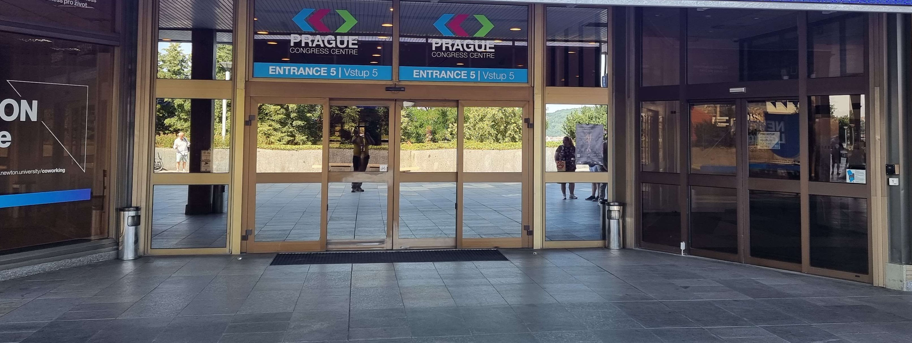

# Accessibility at EuroPython

EuroPython ensures that it’s welcoming, accessible and inclusive for all our
guests attending the conference. If you have suggestions to improve
accessibility, let us know by contacting us at
[helpdesk@europython.eu](mailto:helpdesk@europython.eu).

## General

For enquiries, visit our helpdesk at registration or look for volunteers wearing
Yellow conference t-shirt when enquiring about accessibility which includes:

- Lifts
- Accessible toilet facilities
- Dietary requirements

At main talk rooms, enquire with the session chair before the talks about
designated seating, maintaining clear pathways, or other needs.

### Lift location

For folks who need to use the lifts to access registration on the 1st floor (or
conference on the 2nd floor).

This is the EuroPython entrance.

Go through this and the inner doors. Keep on straight past the blue screen
visible in the background of the 2nd picture.

You get arrive at the corridor in 3rd picture.

Go to the light at the end of the tunnel in 4th picture.

In front of the staircase, turn left.

Keep walking until you see the mural and the lift is located there.

## Feeding your child

The conference venue (The Prague Congress Centre) has childcare rooms; they can be used
for you to breastfeed your child, should you prefer. Please note, there are no
restrictions on where you can breastfeed your child - you are free and welcome
to feed your young ones at any place you feel comforditable with.

## Dietary Requirements

We aim to meet all dietary requirements, when you specify your dietary
requirements during ticket registration.

Menus and its dietary information will be displayed each day to accommodate your
food restrictions. We will also have a dietary station at the bar area on the
second floor foyer - if you are coeliac, or need to avoid any particular
allergen, please come to the dietary station for food.

## The Prague Congress Centre (The PCC)

This is the main venue for EuroPython workshops and the main conference (17th -
21st July). The venue is accessible for wheelchair users. Here’s general
information on how to get to the venue.

**Use Entrance Number 5 to enter the building.**

- [How to get to the PCC](https://www.praguecc.cz/en/how-to-get-here)

### Parking at The PCC

Disabled parking is available at The PCC carpark, please find this information
at https://www.praguecc.cz/en/parking-in-pcc.

### Registration

Registration will be on the **1st Floor**

- Use **Entrance Number 5**
- Staircase to the left and escalators to the right to the **1st Floor**, there
  will be signage to show you the way.
- When you reach **1st Floor**, **Registration Desks** will be in front of the
  cloakroom on the Forum Hall Foyer.

#### Accessibility inside The PCC

- The PCC is accessible for wheelchair users.
- Accessible toilet facilities are available.

### Tutorials - Club Rooms (1st Floor)

### Talks, Quiet Rooms and Childcare (2nd Floor)

### Quiet Room

- If you feel overwhelmed and need a quiet space, you can find the quiet room on
  the **2nd Floor** at **South Room 223 and 224**.

### Childcare

Free childminding is available for attendees, you can request for this free
onsite service when you register your
[ticket](https://ep2024.europython.eu/tickets). If you have questions, please
contact support@europython.eu.

- Childcare is on the **2nd Floor** at **South Room 247 + 248**.

## Accessibility FAQ

This FAQ covers accessibility information for EuroPython. The EuroPython team
recognises that accessibility is a continuous process, both systemic and
individual.

If you have specific questions or accessibility needs not covered here, please
email us at **helpdesk@europython.eu**.

#### Q: Allergies

A: Refrain from wearing scents such as perfumes/colognes, scented lotions,
clothing with strong detergent scents, etc. Notify us of preventable
environmental allergies when purchasing tickets or by email.

#### Q: Will there be captioning?

A: Unfortunately we do not have captioning during EuroPython.

#### Q: What about interpreters?

A: We do not plan to have interpreters at the conference unless we are notified
by signing attendees. If you have questions, please email us.

#### Q. Any suggestions/tips as a volunteer MC or Session Chair?

- Session chairs/room volunteer(s): Let folks know if there's loud, unexpected
  noises, strobing/flashing visuals in speakers' presentations beforehand,
  content & trigger warnings for any potentially sensitive material
- MC and volunteers to remind people to applaud.
- Volunteers to be aware if someone requires designated spaces when they enter
  the room
- Able to assist and let folks know where lifts, accessible toilet facilities,
  childcare, and quiet rooms are.
- What to do in case of fire alarms, sirens, fireworks, bells, etc. happen
  during the event, and guide guest safely out of the venue as well as inform
  updates on the situation

---

# Attributions

Language was incorporated from the following:

- PyConUS: https://us.pycon.org/2019/venue/accessibility/
- IFLA is the International Federation of Library Associations and Institutions
  accessibility checklist:
  https://www.ifla.org/wp-content/uploads/2019/05/assets/lsn/publications/a_checklist_for_accessbiility_at_library_conferences_rev_2021.pdf
- Cevents: Accessibility in Events: Tips and Best Practices (+ Checklist)
  https://www.cvent.com/uk/blog/events/accessible-events-tips-and-best-practices
- Splash: How to Make Your Events More Accessible and Inclusive
  https://splashthat.com/blog/accessible-event-planning
- Alterconf - accessibility info plus presentation guidelines for speakers:
  https://www.alterconf.com/
