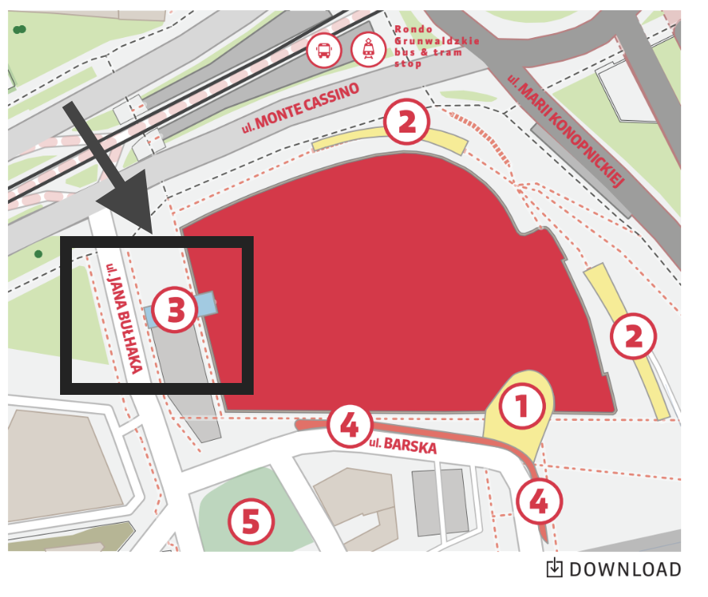
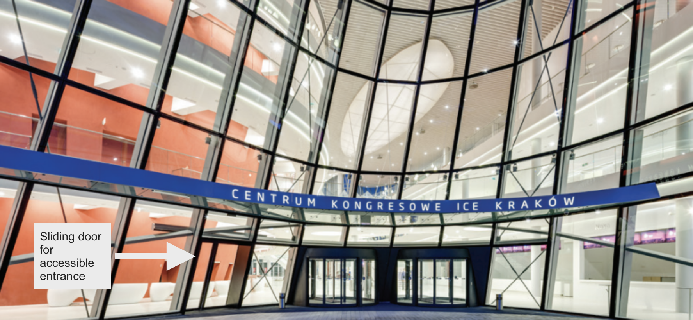
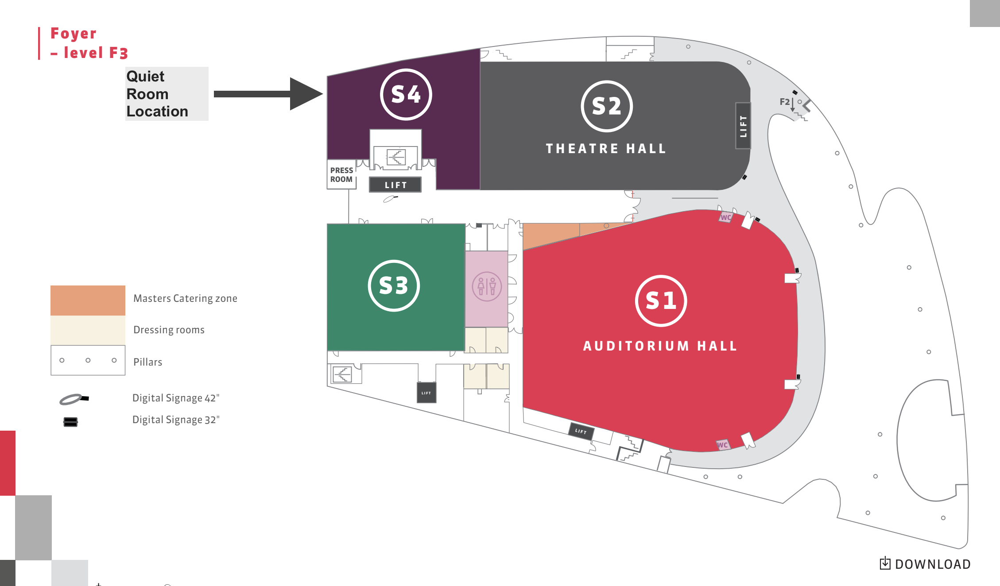
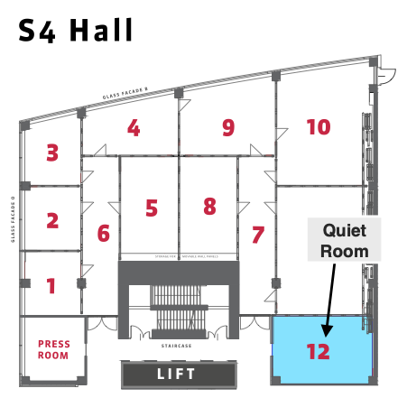

# Accessibility at EuroPython

EuroPython strives to be welcoming, accessible and inclusive for all our
guests attending the conference.
If you have suggestions to improve accessibility, please let us know by contacting us at
[accessibility@europython.eu](mailto:accessibility@europython.eu).

## General

You're very welcome to ask about any accessibility needs. These may include, for example:

- Dietary requirements
- Childcare
- Lifts
- Designated seating
- Help finding your way around the venue
- Designated rooms for quiet time
- Accessible toilet facilities
- Other needs that pop up during the conference
- ...

**Before the conference**, you can leave us a note when ordering your tickets or contact us via email at [accessibility@europython.eu](mailto:accessibility@europython.eu).

**During the conference**, you can visit our Info Desk at registration or speak with our volunteers wearing a yellow conference t-shirt.
Registered ticket holders can also reach out via the Discord server using the "support" channel – please bear with us if it takes a moment to respond.

If you need help for things like designated seating, maintaining clear pathways, or anything else, feel free to speak to the volunteer coordinating the session in the talk rooms as well.

### Neurodiversity bag

We understand that some conference participants can feel overwhelmed by large crowds.
To help with this, we've prepared a bag of fidget items for you to use to relax during the demanding conference days.

- Location: The bag is placed at the Info Desk in the Registration area.

- Contents: The bag contains various items, including fidget and stim toys.

- Usage: Feel free to play and stim with anything you like for as long as you need. We kindly ask that you bring the items back so others can enjoy them as well.

### Childcare

Free childcare is available for attendees during the main conference (Monday-Friday). You can request this free
onsite service when you register your [ticket](https://ep2026.europython.eu/tickets). If you have questions, please
contact [accessibility@europython.eu](mailto:accessibility@europython.eu).

More information is available on the [Childcare page](/childcare).

#### Feeding your child

There are **no restrictions on where you can breastfeed your child** – you are free and welcome
to feed at any place you feel comfortable.

## Conference venue (Monday–Friday)

The [ICE Kraków Congress Centre](/venue) is the main venue for EuroPython 2026.

### Parking at the ICE Kraków Congress Centre

Disabled parking is available in the underground car park, please find this information
at [ICE Kraków Congress Centre's Accessibility Info](https://icekrakow.pl/en/practical-informations/disabled).

### Entrance to the venue

#### During tutorial days (Mon-Tue)

- The entrance is Entrance Number 3, on the West side of the conference venue. It is located off Bułhaka Street, opposite the Park Inn Hotel.
- The entrance is accessible for wheelchair users.
- This entrance is on the ground floor. When you enter, registration will be at this level (ground floor), then you will take the lifts to level 3, where the tutorials are happening. The lifts are on the left-hand side.

#### During conference days (Wed-Fri)

- The main entrance is accessible for wheelchair users.
- The main entrance to the building (off Barska Street) does not have exterior steps or thresholds. At the main entrance, next to the revolving doors, is an additional door on the left hand side, which is activated by a photo cell.

### Inside The Venue

- The venue is accessible for wheelchair users.
- Accessible toilet facilities are available.
- More detailed information is available directly from the [ICE Kraków Congress Centre's Accessibility Info Section](https://icekrakow.pl/en/practical-informations/disabled).

#### Lift location

There are four lifts available in the foyer, which provide access to the venue floors and the underground car park.

#### Rooms

##### Registration (ground floor)

Registration will be located on the **ground floor** in the foyer. The main entrance leads to the ground floor foyer.

##### Toilets

- They are toilets available on every floor that are adapted to the needs of those with reduced mobility.
- Toilets with larger cabins and wash basins are available on the **ground floor**.
- Period products will be available.

##### Quiet Room (3rd floor)

If you need a quiet space to do some work or just rest a bit, we got you.

You can find the quiet room on the **3rd floor** at **S4(12)**.

Please be mindful of others in the room and keep noise to a minimum.

##### Low stimulation room (2nd floor)

- If you feel overwhelmed and need a quiet space with no distractions, feel free to visit **Room Red VIP F2** on the **2nd floor**.
- The room is kept empty.

##### Prayer room (2nd floor)

If you need a quiet space for prayer or meditation, you can find the prayer room in **Dressing Room 206** on the **2nd floor**. Feel free to use this space for your personal needs.

## Accessibility FAQ

This FAQ covers accessibility information for EuroPython. The EuroPython team
recognises that accessibility is a continuous process, both systemic and
individual.

If you have specific questions or accessibility needs not covered here, please
email us at [accessibility@europython.eu](mailto:accessibility@europython.eu).

<Accordion title="Allergies" id="allergies">

Refrain from wearing strong scents such as perfumes/colognes, scented lotions,
clothing with strong detergent scents, etc. Notify us of preventable
environmental allergies when purchasing tickets or by email.
</Accordion>

<Accordion title="Will there be captioning?" id="captioning">

Unfortunately we do not have captioning during EuroPython.
</Accordion>

<Accordion title="What about interpreters?" id="interpreters">

  We do not plan to have interpreters at the conference unless we are notified
  by signing attendees. If you have questions, please email us.
</Accordion>

<Accordion title="What about hearing aid induction loops?" id="induction-loops">
 We do not have hearing aid induction loops at the conference. But all speakers are using microphones, and we live stream the talks (Wednesday-Friday) with audio, so you can listen to the talks from your own device. Unfortunately these streams do have a slight delay.
</Accordion>

<Accordion title="Any suggestions/tips as a volunteer MC or Session Chair?" id="volunteer-tips">

- Let folks know in advance about any loud or unexpected
  noises, strobing/flashing visuals in speakers' presentations, or
  content and trigger warnings for any potentially sensitive material
- Be aware if someone requires designated space when they enter
  the room
- Assist folks by providing directions to lifts, accessible toilet,
  childcare facilities, and quiet rooms.
</Accordion>

---

## Attributions

Language was incorporated from the following:

- [PyCon US](https://us.pycon.org/2019/venue/accessibility/)
- [The International Federation of Library Associations and Institutions'
  accessibility checklist]( https://www.ifla.org/wp-content/uploads/2019/05/assets/lsn/publications/a_checklist_for_accessbiility_at_library_conferences_rev_2021.pdf)
- [Cevents: Accessibility in Events: Tips and Best Practices (+ Checklist)](https://www.cvent.com/uk/blog/events/accessible-events-tips-and-best-practices)
- [Splash: How to Make Your Events More Accessible and Inclusive](https://splashthat.com/blog/accessible-event-planning)
- [Alterconf - accessibility info plus presentation guidelines for speakers](https://www.alterconf.com/)
