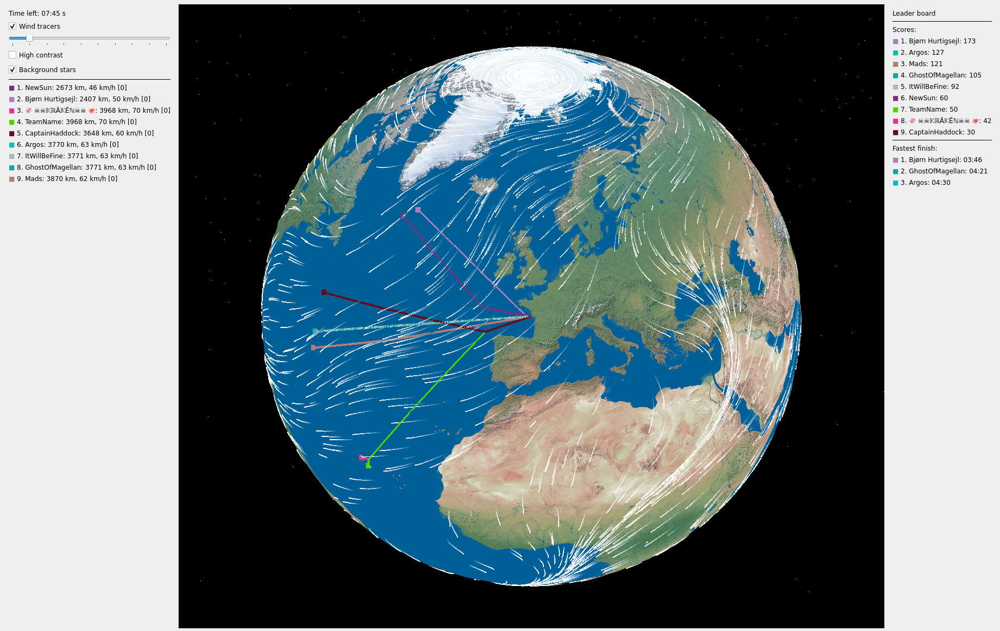
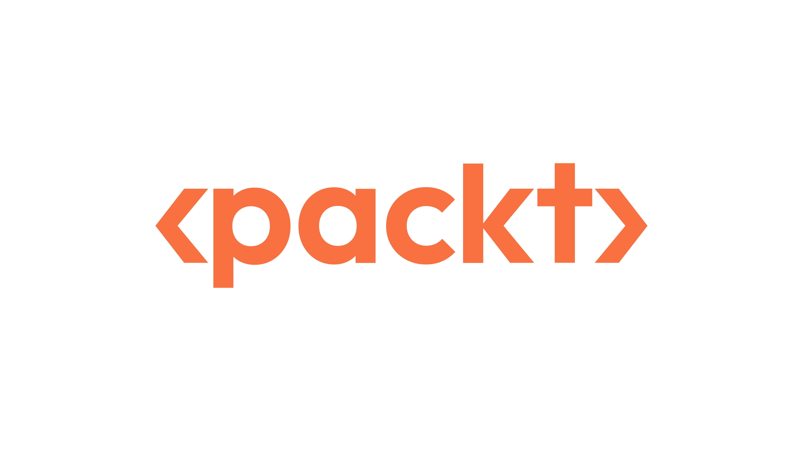
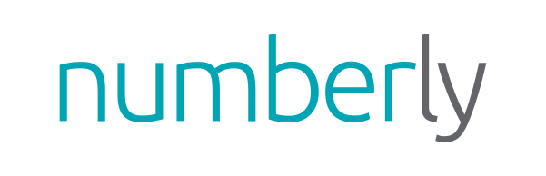

# AI Game Tournament

    <ButtonLink href="https://forms.gle/TosuLTY1zo59FNSz5">Registration From</ButtonLink>

We have created a video game that is designed to be played by a small python program, rather than a human.
Conference attendees can participate in a tournament where they (either alone or in a team) can submit a bot that will play the game,.
At the end of the conference, we will have a tournament session where everyone can come and watch our strange creations play against each other (either brilliantly or it may all go wrong!).

The game is about sailing around the world as fast as possible.

## How to participate?

- Create a repository for your bot from [the template](https://github.com/new?owner=europybots2024&template_name=template_bot&template_owner=europybots2024).
- Register your team: fill in the form at https://forms.gle/TosuLTY1zo59FNSz5 (no limit on the number of participants)
- Read the game rules (link below) and start working on your bot
- Ask questions on the Discord forum
- Once your bot is ready, make sure you have merged all your changes into the main branch of the repo you created
- Deadline is 12:30 on Friday July 12th
- Tournament will be 13:00 - 14:30 on Friday July 12th in the Open Space area

[Check the full instructions here](https://github.com/europybots2024/vendeeglobe#readme)

## Don't be scared

- If you think you may not be good enough at python to participate, think again!
- It's mostly about plotting a good course, so even if you have no python experience, you can probably do something quite good.
- You will also be given a template bot which can already play the game (albeit not very well): all you have to do is improve it 😉
- Finally, if you still don't feel confident enough, find a friend that can help and you can submit the bot as a team.

## Results!

Thanks to everyone who took part, it was really fun!

The final scores were:

1. PyCharm JetBot: 120.07
2. Alpitronic: 103.37
3. SoldiersOfFortune: 71.14
4. Artimi: 68.41
5. ABoatingAccident: 67.78
6. SonarVendee: 59.59
7. nezhar: 53.32
8. SciBot: 45.52
9. Galeon: 38.14
10. tutujnr: 35.29
11. VOLCANES: 31.43
12. Clanata: 27.51
13. sidgupta234: 27.43
14. Numberly: 27.07
15. The torchy: 15.91
16. Firemark: 13.05
17. Big Brain Boat: 12.03
18. The Rising Tide: 12.01
19. SLaB: 11.57
20. PyCon Taiwan: 8.17
21. The Dummy Ifers: 7.01

Big thanks to [Packt](https://www.packtpub.com/en-cz) and [Numberly](https://numberly.com/en/) for providing the prizes :heart: 

Massive thanks to Cristian and Artur for helping me make this happen :pray:

 &nbsp;&nbsp; 
