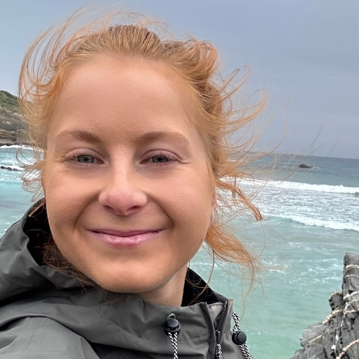
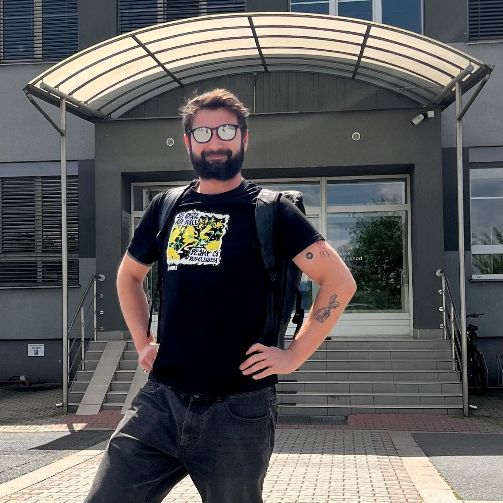
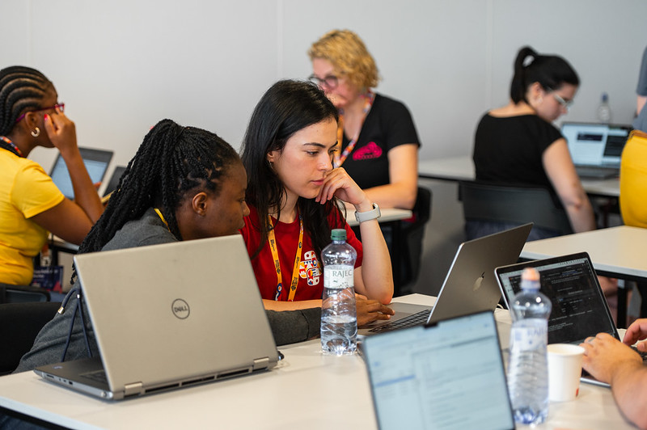
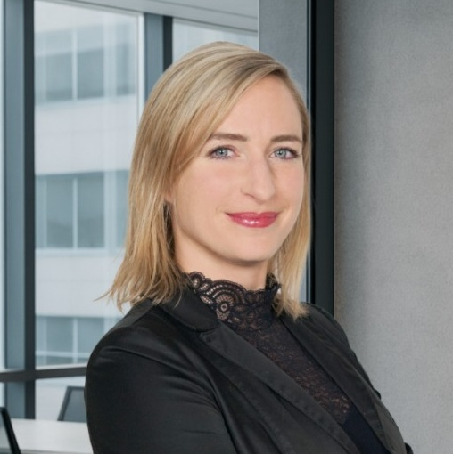
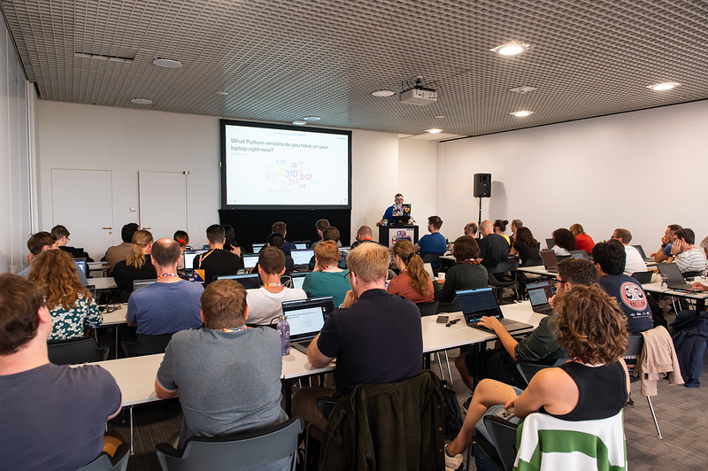
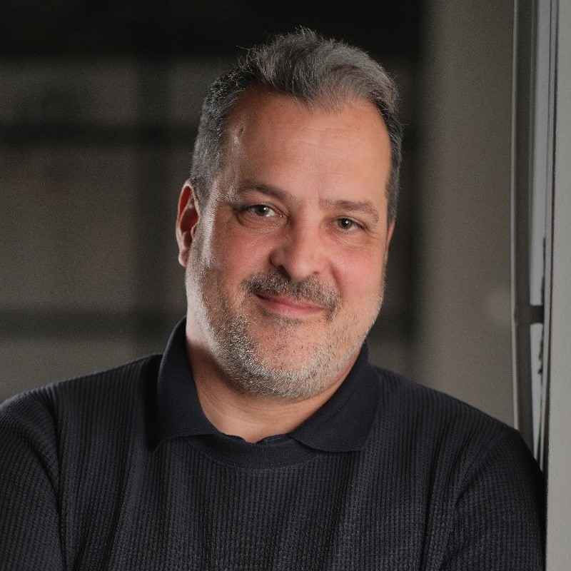
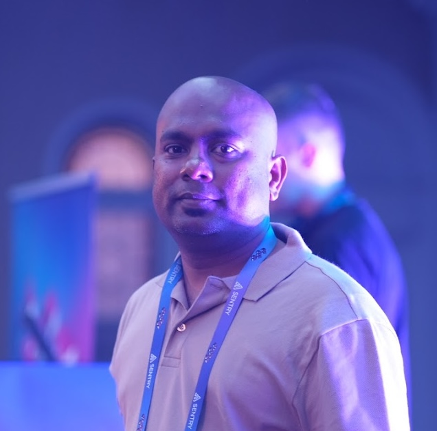

# EuroPython & junior.guru Beginners' Day Unconference

As part of this year's Beginners' Day, on **Saturday 19th July** we'll be hosting the Unconference in cooperation with [junior.guru](https://junior.guru/). It's a full day of panel discussions, Q&A sessions, interactive sessions, and short talks focused on getting started and growing as a junior in a tech role.

## Program

### Panel discussion: How to Succeed In A Junior Role

Listen to a panel discussion with three junior developers as they share what life is really like after landing their first tech job. They’ll talk about working with colleagues, asking for help effectively, getting useful feedback, avoiding common pitfalls, overcoming early challenges, and the surprises they encountered along the way.

  <a href="https://www.linkedin.com/in/michaela-trckova-fe-dev/" class ="hover:scale-105 transition-transform" class ="hover:scale-105 transition-transform" style={{ textDecoration: 'none', color: 'inherit' }} target="_blank" target="_blank">
    

      
      
        Michaela Trčková 
        Associate Software Engineer 
        @ Mews
      
    

  </a>

  <a href="https://www.linkedin.com/in/miloslav-jezek/" class ="hover:scale-105 transition-transform" style={{ textDecoration: 'none', color: 'inherit' }} target="_blank">
    

      
      
        Miloslav Ježek 
        Product Developer 
        @ FPT Czech
      
    

  </a>

  <a href="https://www.linkedin.com/in/fusatytata/" class ="hover:scale-105 transition-transform" style={{ textDecoration: 'none', color: 'inherit' }} target="_blank">
    

      
      
        Šimon Kořený 
        Product Owner 
        @ Branchis
      
    

  </a>

### Workshop: How To Succeed As A Junior

This interactive workshop puts you right in the center of the conversation. You’ll join a small group of fellow junior developers, each guided by an experienced mentor. Together, you’ll tackle real-world questions like: How do you identify transferable skills during a career change? What’s the best way to highlight your strengths in an interview? How do you stay motivated when the job gets tough?

Each group will explore these topics through open discussion, drawing on personal experiences and shared insights. At the end, we’ll come back together so each group can share one or two of their best takeaways with everyone. Bring your curiosity, your questions, and your voice—this is a session built for learning from each other.

### Panel discussion: Landing A Great Job

What makes a candidate stand out? How do hiring managers really make decisions? In this panel, experienced recruiters and engineering leaders share what they’ve learned from hiring hundreds of people into tech roles. You’ll hear insider tips on what makes an application shine, how to navigate interviews, and what signals success once you're on the job.

Whether you're switching careers or just starting out, this is your chance to learn what the other side of the hiring table is really thinking—and how you can use that knowledge to land a role you’ll love.

  <a href="https://www.linkedin.com/in/janamoudra/" class ="hover:scale-105 transition-transform" style={{ textDecoration: 'none', color: 'inherit' }} target="_blank">
    

      
      
        Jana Moudrá 
        CEO 
        @ Juicymo
      
    

  </a>

  <a href="https://www.linkedin.com/in/barbora-nemcova/" class ="hover:scale-105 transition-transform" style={{ textDecoration: 'none', color: 'inherit' }} target="_blank">
    

      
      
        Barbora Němcová 
        Head of HR 
        @ Pale Fire Capital
      
    

  </a>

### Discussion Circle: Junior vs. Senior

Join us for an engaging discussion where empathy takes center stage! What aspects of job interviews make no sense to juniors? Why do some leave for better opportunities after just a year? Why do beginners hesitate to ask for help when they get stuck?

On the other hand, what do seniors expect from juniors? What is it like to mentor less experienced colleagues, and how can it be done effectively? How can juniors ask questions without interrupting or slowing down their mentors? And how does one even become a senior in the first place? How did experienced developers learn throughout their careers, and how did they negotiate for better salaries?

Come share your perspective and help us explore those questions together!

### Q&A session: From Junior To Senior

You’ve landed your first job—now what? In this open Q&A session, we’ll explore the path from junior to senior developer, a journey that’s often less talked about but just as important. Bring your questions and hear honest, practical answers from experienced guests who’ve made the leap themselves or helped others do it.

We’ll cover topics like growing your skills, earning trust, taking on more responsibility, and navigating the messy middle of a tech career. Whether you’re curious about what “senior” really means or just want to know what to focus on next, this is your chance to ask.

  <a href="https://www.linkedin.com/in/gaborambrozy/" class ="hover:scale-105 transition-transform" style={{ textDecoration: 'none', color: 'inherit' }} target="_blank">
    

      
      
        Gábor Ambrózy 
        EMEA Support Manager & Site Leader 
        @ Liferay
      
    

  </a>

  <a href="https://www.linkedin.com/in/citizenmani/" class ="hover:scale-105 transition-transform" style={{ textDecoration: 'none', color: 'inherit' }} target="_blank">
    

      
      
        Manivannan Selvaraj 
        Software Engineer 
        @ Experian
      
    

  </a>

### Lightning talks: My Journey To IT

Did you take an unexpected path into your first tech job? Faced challenges you didn’t anticipate? Got a piece of advice that made all the difference? Come share your story!

At the end of the day, we’re opening the stage for juniors to give short lightning talks about how they landed their first job in IT—what worked, what was hard, and what they learned along the way. This is a great opportunity to inspire others and reflect on your own journey.

Want to participate? Just add your name and topic to the sign-up flipchart at the venue during the day. Talks can go up to 10 minutes, but 5 minutes is perfect—let’s keep it snappy! No slides required—just your story and insights, but feel free to bring them if you’d like.

Whether you want to speak or just listen, this is a fantastic chance to learn, get inspired, and support fellow newcomers in the tech world!

## Sign up

EuroPython Beginners' Day Unconference is open to everyone, from high school students to late career changers. Entry is free for EuroPython ticket holders (any ticket type), and €5 otherwise.

<Button url="https://ep2025.europython.eu/beginners-day/#how-do-i-sign-up">Sign Up For The Unconference!</Button>

Applications are open until we run out of tickets. There are 48 spots available.
