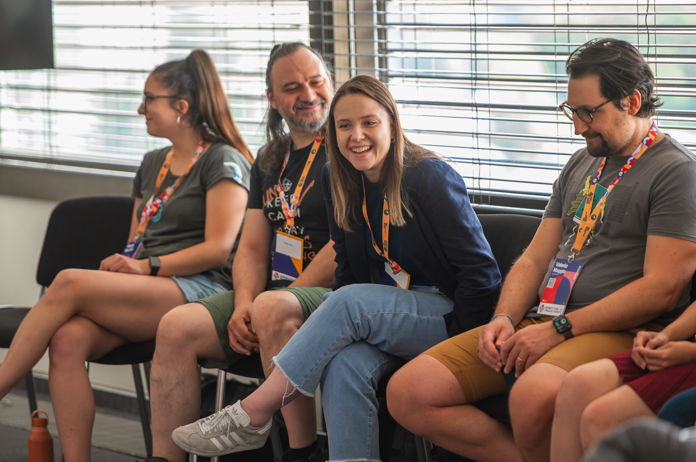
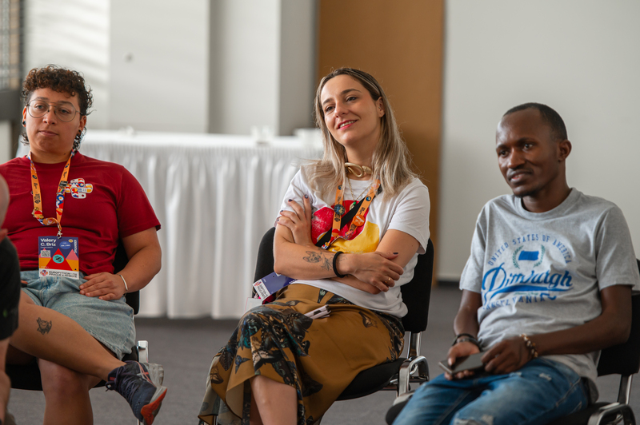
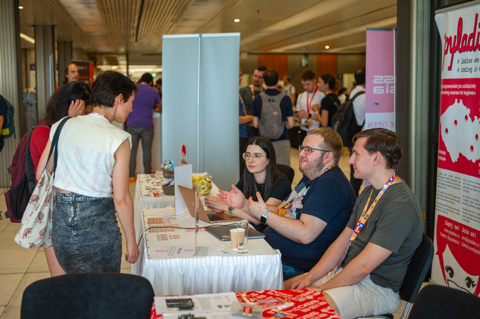
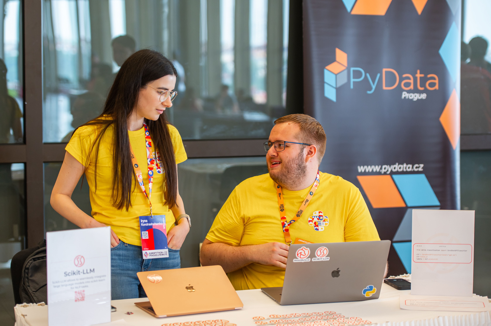

# Community Organisers Activities

The Python community is an essential part of the language, and for many people, it's
the reason they stick around and keep meetups, conferences, forums, and so much more running to help others.

This year at EuroPython, we have several activities focused on communities across Europe and around the world, as well as initiatives centered around Python itself.

## Community Organisers Open Space

Communication is key to avoiding repetition and learning from past mistakes.
Let's come together and share the experiences of our communities, as well as and our personal
challenges and successes, so that more communities can grow and improve.

This year, we are dedicating a two-hour slot in the Open Spaces to all community organisers who want to share their experiences. More
importantly, it's a chance to explore how the EuroPython Society can support you in achieving your
goals and addressing your current challenges.

* Room: 223+224
* Time: Friday 18th, 12:00h - 13:00h

## Community Organisers Lunch

Do you know all the organizers from other European Python communities and conferences?
If not, this is a great opportunity to meet more people who, just like you, are doing their best to keep Python events and communities alive—so that more people have the chance to learn, connect, and grow with Python!

We'll be meeting on Friday, July 18, at 12:55 in the Zoom room on the first floor near the registration area for a special lunch—an opportunity to connect with others who share your passion.

## Community Booths

Each year, we reserve booth space for communities, initiatives, nonprofit organizations, and open source projects that support the Python community and the wider open source ecosystem.
Join us in the Exhibit Hall during the main conference days to meet this year’s amazing Community Booth lineup!

<Button url="https://forms.gle/p2cG6YAXxoq1qRd69">Sign Up For a Booth!</Button>

## PyLadies Open Space & Lunch

Check out [the PyLadies activities page](/pyladies) for more information.
