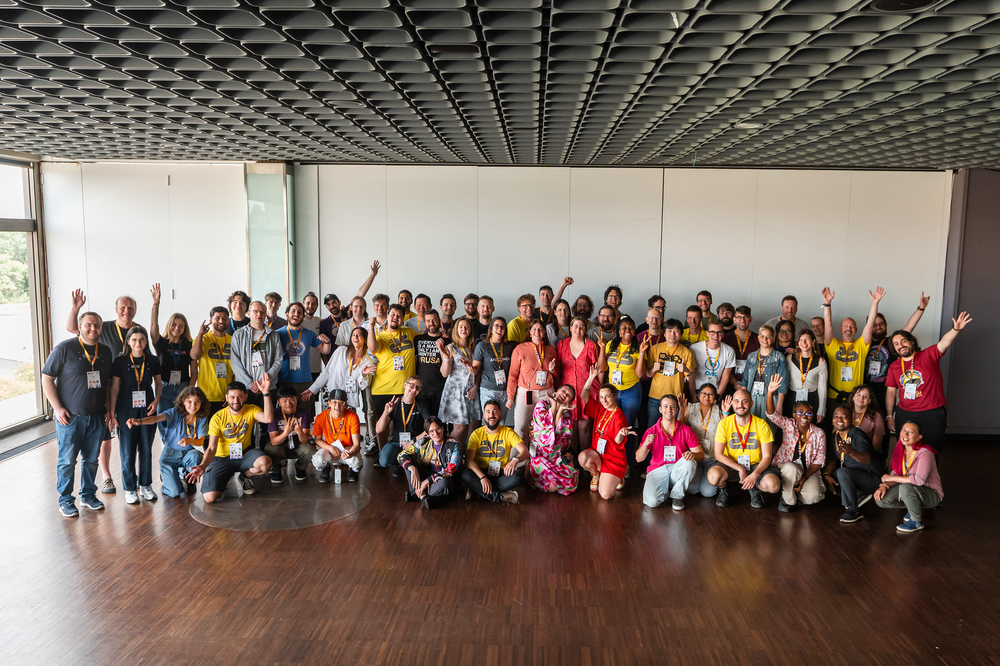
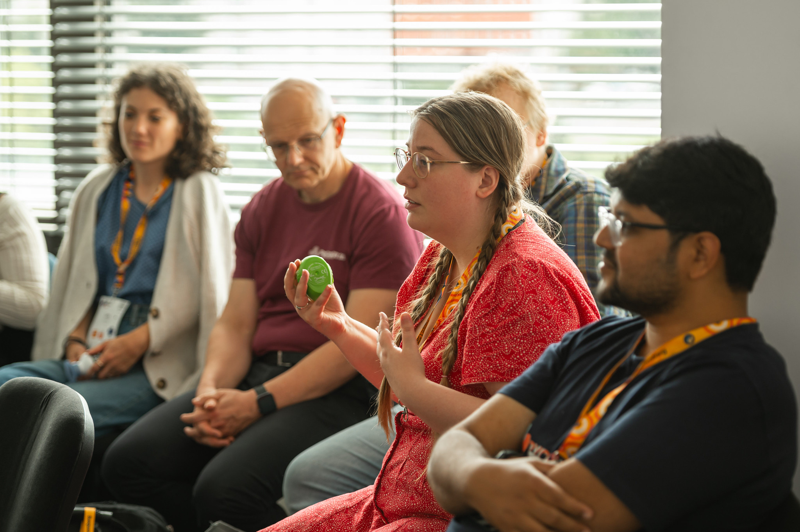
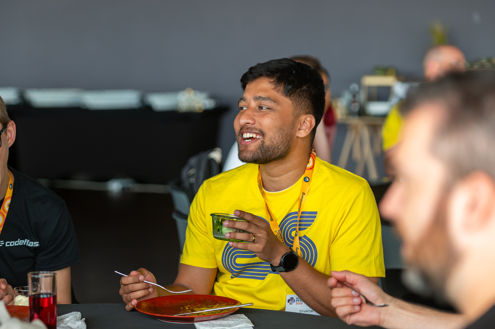
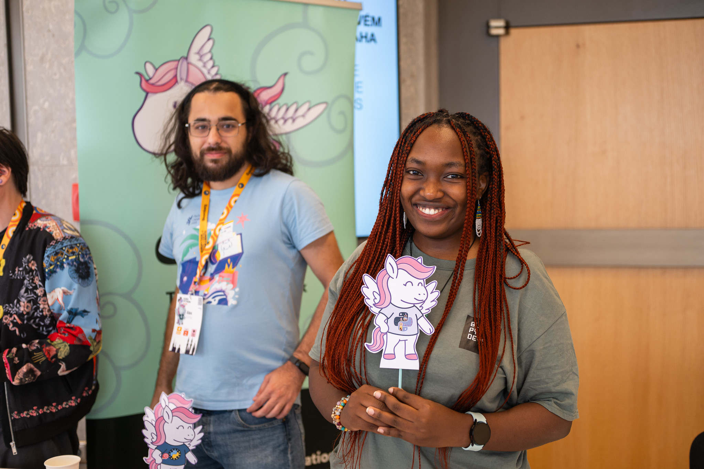

# Community Organizers Summit

The vibrant Python community plays a key role in driving the language's growth and success by engaging individuals through meetups, conferences, forums, and numerous other opportunities.

Effective communication is essential to avoid redundancy and learn from past mistakes. By gathering at EuroPython, we can exchange stories of our community experiences, as well as share personal challenges and triumphs, empowering more communities to prosper and progress.

At EuroPython 2026, we are excited to host a special Community Organizers Summit. This event brings together individuals who actively contribute to organizing Python events and communities across Europe and beyond. The goal is to facilitate networking, knowledge sharing, and collaboration among community organizers.

### What to Expect

The **Community Organizers Summit** is designed as a collaborative, hands-on experience that moves from shared context into deeper discussion and practical reflection.

It begins with a **short introduction**, setting the stage for the day’s activities and welcoming attendees from across the Python community.

From there, the summit moves into **facilitated small group discussions**, where participants explore topics related to organizing Python events and communities. These sessions are designed to encourage in-depth conversation, knowledge sharing, and exchange of real-world experiences.

Each group will then come back together for **short presentations**, sharing key insights, discussion points, and conclusions that emerged during their conversations.

In essence, the Community Organizers Summit is a crucial component of EuroPython, bringing together organizers from across the Python ecosystem to connect, learn from one another, and collaborate on strengthening their communities.

Whether you're organizing a local meetup, a regional conference, or a large-scale community initiative, the summit is an opportunity to learn from peers, share experiences, discuss common challenges, and build stronger connections across the Python ecosystem.

- **Location:** Glass room (Floor 0)
- **Time:** Friday 17 July 10:45
- **Program:** (TBD: link to the schedule)

---

### Featured Workshop

**The Experience Is the Community** by ***Georgi Ker***

The day concludes with a featured, interactive workshop exploring the POPCOM model (Participation, Connection, Mentorship). Through structured exercises and reflection, participants will examine their own communities and leave with practical tools to improve engagement and community experience.

- **Location:** Glass room (Floor 0)
- **Time:** Friday 17 July 14:30
- **Program:** https://ep2026.europython.eu/session/the-experience-is-the-community

---

## Community Organisers Lunch

Have you had the pleasure of meeting all organizers from other Python communities and conferences? If not, this is an exceptional opportunity to expand your network and engage with passionate individuals dedicated to nurturing Python events and communities. By connecting with each other, we can create more chances for learning, networking, and personal growth through Python.

- **Location:** Red carpet (Floor 2)
- **Time:** Friday 17 July 12:55

---

## Community Booths

Each year, we reserve booth space for communities, initiatives, nonprofit organizations, and open source projects that support the Python community and the wider open source ecosystem.

Don't miss out on this opportunity to learn, develop, and contribute to something greater!

- **Location:** Community area (Floor 0)
- **Time:** Wednesday 15 – Friday 17 July

## PyLadies Open Space & Lunch

A series of initiatives that foster connections, learning, and growth for underrepresented groups in Python.

Through talks, workshops, and networking opportunities, these events empower diverse communities within the ecosystem, promoting continuous progress and equitable representation.

Check out [the PyLadies activities page](https://ep2026.europython.eu/pyladies) for more information.
