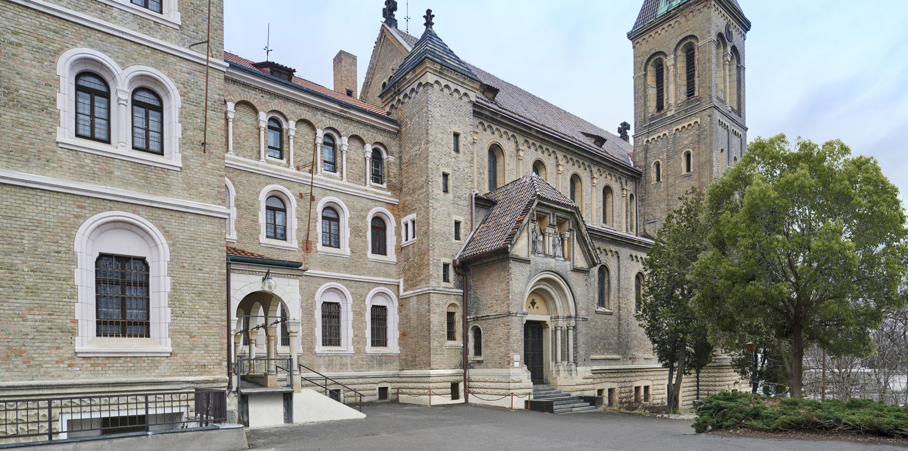
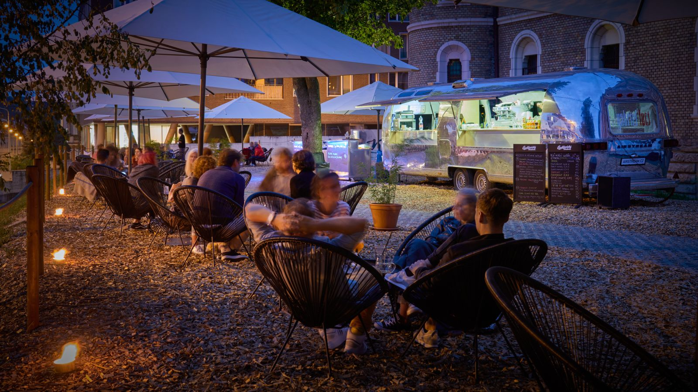

# Join Us For The Night Full Of Fun!
Located in the heart of Prague, the historic Gabriel Loci ex-monastery is our venue for our main social event featuring:
* **Board Games Night**: A dedicated area for playing board games.
* **Chit-Chat with a View**: Enjoy conversations with a stunning night view of Prague.
* **Chill and Quiet Spaces**: Plenty of area to relax.
* **Singing and Playing Instruments**: Bring your instruments and join us for a musical evening of singing and playing together!

# Bring Your Board Games
Bring your games! We will have an area dedicated to board games and encourage everyone to bring their own. Whether you're an experienced gamer or a novice, you're welcome to join!

# Bring Your Instruments!
If you love playing instruments, bring them along! Let’s make some music together.

# Ticket
**Please note: The social event is not included in the conference ticket!**

Tickets for the social event will be available in our ticket shop soon! These tickets will be limited, so mark your calendar and make sure to secure yours as soon as they become available.

# When & Where?
* **When**: Thursday, July 11th at 7 pm CEST
* **Where**: [Gabriel Loci](https://www.google.com/maps/place//data=!4m2!3m1!1s0x470b94ffe90d8bef:0xe44f072ee3ed8c90?sa=X&ved=1t:8290&ictx=111)

## How To Get There?
* **By Tram or Metro**: Take a tram or metro to the Anděl station, then enjoy a 15-minute [walk](https://www.google.com/maps/dir/And%C4%9Bl,+Sm%C3%ADchov,+Prague+5/Hole%C4%8Dkova+106%2F10,+150+00+Praha+5-Sm%C3%ADchov/@50.073105,14.3898466,15z/data=!3m1!4b1!4m14!4m13!1m5!1m1!1s0x470b9457a74fb1ab:0xa62bdf37f7f0819b!2m2!1d14.403903!2d50.071129!1m5!1m1!1s0x470b94ffe90d8bef:0xe44f072ee3ed8c90!2m2!1d14.3960143!2d50.0749021!3e2?entry=ttu).
* **By Bus**: Take bus 176 to the Holečkova station, which is right in front of the venue.

# Food & Drinks
We will be offering a selection of small snacks to cater to various dietary requirements, including vegetarian, vegan, and gluten-free options.

Additionally, you can look forward to refreshing non-alcoholic lemonades, as well as a selection of craft beers from the local brewery Pivovar Bubeneč. More details will be provided soon.
