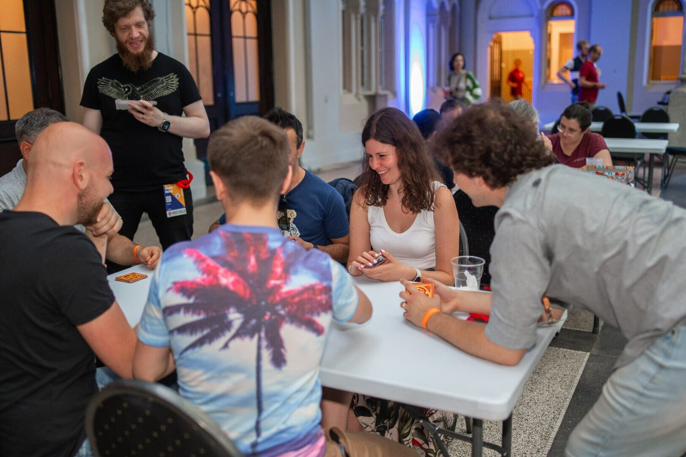

# Join Us at Forum Fun & Food for a Fun Evening

Right on the bank of the Vistula River, just a short walk from the conference
venue, [Forum Fun & Food](https://forumff.pl/) sets the stage for our main
social event on **Thursday, 16th July, 19:00–midnight**. Expect a fun evening
with:

- **Bowling zone** — grab your friends and hit the lanes.
- **Video games area** — arcade fun for everyone.
- **Billiards room** — for a more laid-back game.
- **Dance workshops** — learn some new moves.
- **A dedicated event room** with a DJ and catering.

All attractions located within these zones will be available to participants
throughout the entire duration of the event — they're included in the rental,
so play as much as you like!

There's also a Latino night — the venue's regular Thursday event — happening in
the main hall. It's not part of our event, but we're welcome to join in!

## Bring Your Board Games

We'll have space reserved for board games, so whether you're into competitive
strategy or casual party games, bring your favourites along!

## Bring Your EuroPython Memorabilia

2026 marks the 25th edition of EuroPython, and we're celebrating with
[two anniversary contests](/25yearsofep) on the night: the oldest EuroPython
T-shirt and the oldest badge each win a prize. Dig out your oldest conference
swag and bring it along — winners will be crowned and awarded during the event!

## Tickets

**Please note:** This event is not included in the conference ticket.

Tickets will be available via our ticket shop soon and will be limited in
number. You will receive the voucher code to pre-order them by email. Please
note the event is meant for conference attendees only.

## When & Where?

- 🗓 **Thursday, 16th July, 19:00–midnight CEST**
- 📍 [Forum Fun & Food, Marii Konopnickiej 28, Kraków](https://www.google.com/maps/dir/?api=1&origin=ICE+Krak%C3%B3w+Congress+Centre&destination=Forum+Fun+%26+Food%2C+Marii+Konopnickiej+28%2C+Krak%C3%B3w&travelmode=walking)

## Getting There

- **On foot:** ten minutes' walk from the main venue.

## Food & Drinks

Catering will be provided in the dedicated event room, including vegetarian,
vegan, and gluten-free options. Drinks will be available as well — both
alcoholic and non-alcoholic.

## Accessibility Information

We want to make this event enjoyable for everyone. **If you need assistance,
please contact us in advance so we can arrange for help.**
