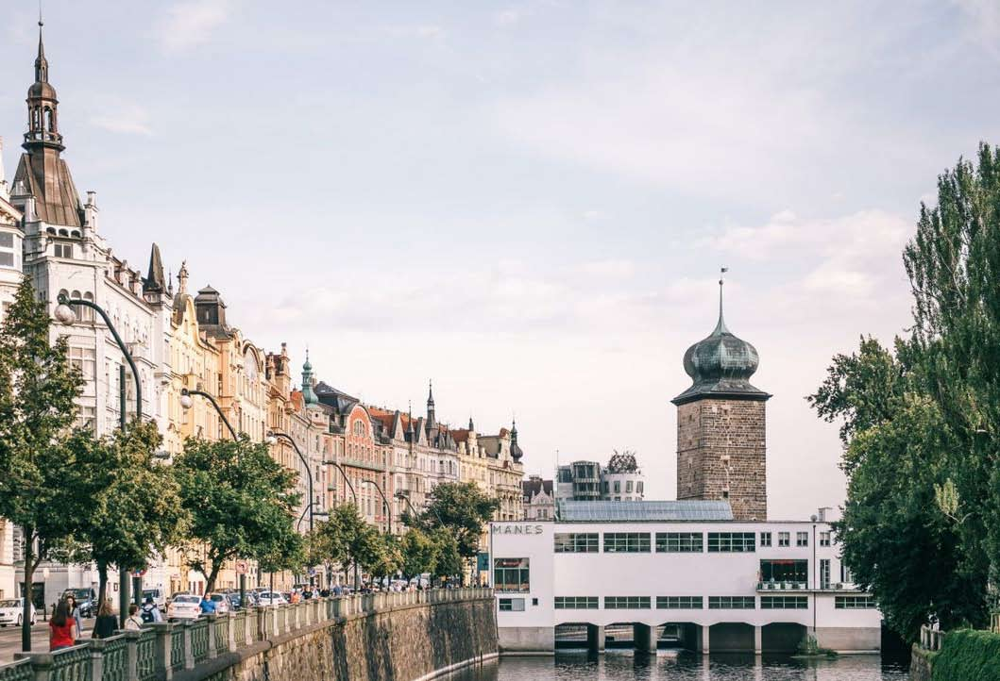

# Speakers' Dinner
We are excited to announce a special Speakers' Dinner! This exclusive event is for speakers only, providing an opportunity to meet and mingle before the main conference days.

The dinner will feature multiple courses, and you can choose from a variety of alcoholic and non-alcoholic beverages. We also offer a variety of options to accommodate different dietary preferences, including vegetarian, vegan, and gluten-free.

# Where?
The Speakers' Dinner will be at [the Mánes restaurant](https://manesrestaurant.cz/en) on the Vltava riverfront in Prague, featuring creative functionalist architecture and panoramic views of the Vltava River, the Dancing House, and the National Theatre.

Address:
<address>
Masarykovo nábř. 250/1  
110 00 Nové Město, Czechia 

</address>

## How to get there?
* Take trams 2, 5, 9, 13, 15, 17, 18, 19, 22, 24, or 27 to Jiráskovo náměstí station. From there it is a 2-minute walk to the restaurant.
* [30 minutes on foot](https://www.google.com/maps/dir/Prague+Congress+Centre,+5.+kv%C4%9Btna,+Prague+4-Nusle,+Czechia/Art+Restaurant+M%C3%A1nes,+Masarykovo+n%C3%A1b%C5%99.+250%2F1,+110+00+Nov%C3%A9+M%C4%9Bsto,+Czechia/@50.0697187,14.4116608,15z/data=!4m15!4m14!1m5!1m1!1s0x470b9464c186eb79:0x4d26855708eb61f7!2m2!1d14.4290206!2d50.0625764!1m5!1m1!1s0x470b952eddf2f267:0xbd409c6e6af026e!2m2!1d14.41412!2d50.0774996!3e2!5i2?entry=ttu) from the Prague Congress Center

# When?
On Tuesday July 9th at 7.30 p.m.

# Registration
Please note that registration is required. Register through Pretix by adding the event to your speaker ticket.

# Menu Highlights

## Food Menu

### Starters
- Confit fried pork belly with tamarind sauce, chili, and coriander
- Stracciatella Mozzarella with fresh tomatoes and homemade pesto
- Pea puree, fava beans, barley popcorn, parsley oil

### Warm Buffet
- Chicken schnitzel with herb breadcrumbs
- Ragout of pork cheeks in black beer
- Potato puree
- Seitan goulash on wine (vegan)
- Thai Vegetable Green Curry with Coconut Milk, Coriander, and Lemongrass (Vegan, Gluten-Free)
- Potato pancakes (vegan)
- Jasmine rice (vegan)

### Salad Bar
A delightful selection of:
- Peppers, tomatoes, cucumbers
- A variety of dressings
- Olives, vegan marinated cheese, fried bacon
- Mixed salad leaves, sun-dried tomatoes

### Desserts
A variety of mini desserts to satisfy your sweet tooth:
- Choux
- Cheesecake
- Panna Cotta
- Chocolate Mousse
- Note: At least one vegan and one gluten-free dessert option available

### Bread
- Homemade bread

## Drinks Menu
**Unlimited consumption for 3 hours**

### Non-Alcoholic Drinks
- Selection of homemade lemonades and juices
- Natura (still water, sparkling water)
- Kinley Tonic
- Cola, Fanta, Sprite
- Coffee, Tea

### Beer
- Svijany Beer
- Non-alcoholic Beer Svijany

### Selection of White Wine
- **White Wine N. 1** – Rulandské Šedé, Zemské, Sedlák (Dry)
- **White Wine N. 3** – Chardonnay, Spielberg (Dry)

### Selection of Red Wine
- **Red Wine N. 4** – Côtes du Rhône, Chateau de Manissy (Dry)
- **Red Wine N. 6** – Blue Portugal, Spielberg, Pozdní Sběr (Dry)
