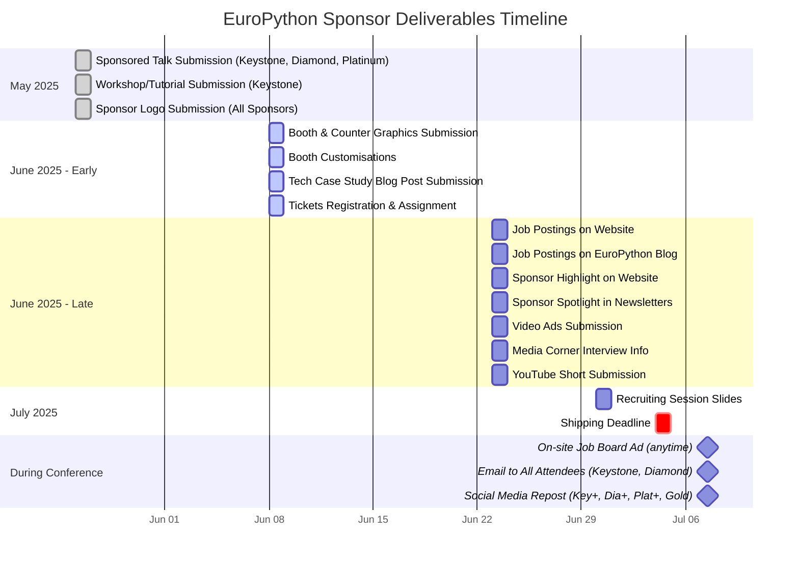

```mermaid
gantt
    title EuroPython Sponsor Deliverables Timeline
    dateFormat  YYYY-MM-DD
    axisFormat  %b %d

    section May 2025
    Sponsored Talk Submission (Keystone, Diamond, Platinum)     :done,  task1, 2025-05-26, 1d
    Workshop/Tutorial Submission (Keystone)                     :done,  task2, 2025-05-26, 1d
    Sponsor Logo Submission (All Sponsors)                      :done,  task3, 2025-05-26, 1d

    section June 2025 - Early
    Booth & Counter Graphics Submission                         :active, task4, 2025-06-08, 1d
    Booth Customisations                                        :active, task5, 2025-06-08, 1d
    Tech Case Study Blog Post Submission                        :active, task6, 2025-06-08, 1d
    Tickets Registration & Assignment                           :active, task7, 2025-06-08, 1d

    section June 2025 - Late
    Job Postings on Website                                     :task8, 2025-06-23, 1d
    Job Postings on EuroPython Blog                             :task9, 2025-06-23, 1d
    Sponsor Highlight on Website                                :task10, 2025-06-23, 1d
    Sponsor Spotlight in Newsletters                            :task11, 2025-06-23, 1d
    Video Ads Submission                                        :task12, 2025-06-23, 1d
    Media Corner Interview Info                                 :task13, 2025-06-23, 1d
    YouTube Short Submission                                    :task14, 2025-06-23, 1d

    section July 2025
    Recruiting Session Slides                                   :task15, 2025-06-30, 1d
    Shipping Deadline                                           :crit,  task16, 2025-07-04, 1d

    section During Conference
    On-site Job Board Ad (anytime)                              :milestone, task17, 2025-07-07, 1d
    Email to All Attendees (Keystone, Diamond)                  :milestone, task18, 2025-07-07, 1d
    Social Media Repost (Key+, Dia+, Plat+, Gold)               :milestone, task19, 2025-07-07, 1d
```
