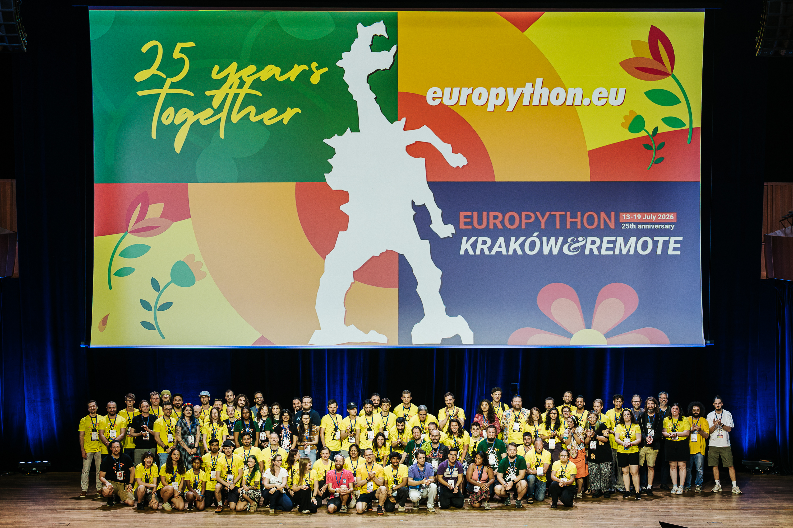
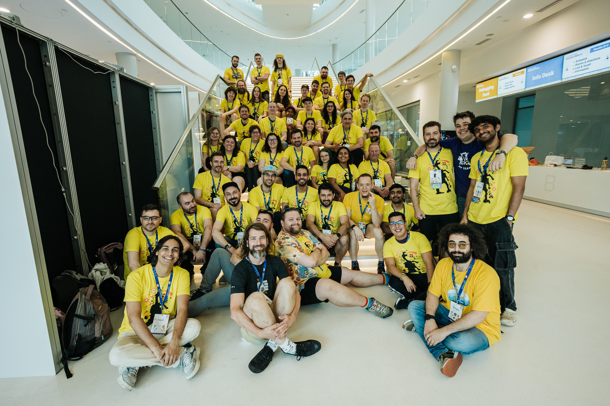

# Thank You 🤗

EuroPython has been organised by volunteers since 2002, driven by the passion
and dedication of the community.

What does it take to organise a conference? Let's go through it chronologically
and tell you a bit more about the efforts and people behind it.

## EuroPython Society Board 🏛️

Before the conference preparations even start, a board is elected annually. The
board manages the day-to-day operations of the EPS, the non-profit behind the
series. They're responsible for fiscal and legal work, as well as making the
conference happen. That includes picking a location, finding a suitable venue,
local lawyers and accountants.

Finally, the board finds leads and builds teams of volunteers to work in
different areas.

The board members for the 2026 conference are:

- Anders Hammarquist
- Angel Ramboi
- Aris Nivorlis
- Artur Czepiel
- Ege Akman
- Mia Bajić
- Yuliia Barabash

## Team Anežka 💪

- Anežka Müller

Following our successful collaboration last year, Anežka continued to provide
support this year too as our event manager.

She handled communication with all suppliers, relieving volunteers and board
members of logistical tasks. She coordinated with the venue, catering, speakers'
dinner, social events, sprints venue, booth builders, t-shirts, stickers, and
numerous other smaller suppliers.

We are deeply grateful to Anežka for her invaluable work and all the support she
provided throughout the year.

## Programme 📅

This team manages the Call for Proposals, Community Voting, Proposals Screening,
Panels, final selection of the Talks, Tutorials, Posters, Scheduling, Keynotes,
Open Spaces, and all the last minute cancellations 😅.

- Cristián Maureira-Fredes
- Diego Russo
- Maria José Molina Contreras
- Marina Moro Lopez
- Naa Nortey
- Rodrigo Girão Serrão

## Speaker Mentorship 🎓

In parallel with the Call for Proposals, we kick off the Speaker Mentorship
Programme. It's designed to help new and less experienced speakers submit
proposals and, if accepted, build their confidence and prepare their talks.

- Naa Nortey

## Communications 📧

The Communications team works year-round, however they are at their busiest
during the conference week itself. Daily updates, monthly newsletters, Wi-Fi
passwords, venue maps, and website copy are all things produced by this
incredible team. There are quite a few more forms of communication that we
didn't yet mention. Unsurprisingly, they all come under the Communications
remit, too!

- Daria Linhart Grudzien
- Andrew Northall
- Celina Czyszczon
- Mia Bajić
- Sangarshanan Veera

## Design 🎨

The Design team is responsible for producing high quality artwork and visual
content, especially the EuroPython social media posts that accompany the
communications copy written by the Communications team. They work closely with
Communications to ensure all visual deliverables are on-brand and polished.

- Mia Bajić
- Daksh P. Jain

## Infrastructure 💻

Thanks to our local superstar for his all-round help.

- Marcin Wierzbanowski

## EuroPython Advocacy 🗣️

- Maciej Majewski

This role is crucial for spreading the word about EuroPython and building
excitement in the local community. With EuroPython 2026 taking place in Krakow,
we were fortunate to have Maciej Majewski as our advocate. As the organiser of
PyData Krakow, Maciej helped us build local support.

## Sponsorship 🤝

The conference runs from ticket sales and sponsorships. The Sponsors Team
contacts sponsors early, manages contracts, invoices, logistics and ensures all
deliverables are fulfilled by other teams.

- Kshitijaa Jaglan
- Angel Ramboi
- Artur Czepiel
- Iryna Kondrashchenko
- Oleh Kostromin
- Raquel Dou

## Financial Aid 💰

This team manages financial aid applications, selects recipients, handles
communications, and ensures invoices are submitted:

- Theofanis Petkos
- Aris Nivorlis
- Doreen Peace Nangira Wanyama
- Panagiotis Skias
- Raquel Dou

## Operations ⚙️

This is the largest team, divided into several smaller teams. You might have met
them onsite or online when contacting our helpdesk.

### Operations Team

- Jake Balas
- Aeneas Christodoulou
- Aris Nivorlis
- Çınar Fidanboy
- George Zisopoulos
- Jakub Červinka
- Janusz Kamieński
- Kshitijaa Jaglan
- Liberta Gani
- Mahe Iram Khan
- Martin Borus
- Moisés Guimarães
- Niklas Mertsch
- Panagiotis Kyrillos
- Piotr Gnus
- Raquel Dou
- Szymon Cader
- Toomas Ormisson

### Discord Team

Everyone with a valid conference ticket received access to our Discord server,
where participants could chat with fellow attendees, speakers, and organisers.
The Discord team managed the server, ensuring that participants had access and
the appropriate permissions.

A huge thank you to Niklas Mertsch for leading the Discord team and to Szymon
Cader for his significant contributions!

The work involved in maintaining and updating the Discord bot can be found in
the EuroPython Discord bot repository: https://github.com/EuroPython/discord

### A/V Team

Although an external supplier handled the streaming and recording, this team
coordinated with the venue, managed the digital screens, and dealt with
unexpected technical issues.

A big thank you to Raquel Dou, Piotr Gnus, Panagiotis Kyrillos, Aeneas
Christodoulou, and Anežka Müller for coordinating all things A/V!

### Registration Desk

The registration desk is one of the first points of contact for everyone
arriving at EuroPython. Thanks to the careful preparation and coordination of
Martin Borus and Gaweng Tan, registration was a smooth experience for both
attendees and the onsite volunteers working at the desk.

A huge thank you to Martin and Gaweng for making everyone’s arrival so welcoming
and well organised!

### Helpdesk

Throughout the conference, the helpdesk answered questions and assisted
participants whenever they needed support.

A special thank you to George Zisopoulos, who led the helpdesk and worked
relentlessly to answer questions, resolve issues, and help everyone who reached
out.

As soon as you enter the conference, some of the first people you see are those
wearing yellow T-shirts—our Pockets of Sunshine ☀️. These are our onsite
volunteers, who assist attendees, chair sessions, distribute materials, and help
keep the conference running smoothly.

A huge thank you to Janusz Kamieński for coordinating the entire onsite
volunteer team and ensuring that everyone had the information and support they
needed throughout the conference.

### Onsite Volunteers Team

Once you enter the conference, the first thing you see are people in yellow
t-shirts (🦸 Pockets of Sunshine ☀️). They're our volunteers, who assist
attendees, chair sessions, and hand out materials.

- Aditri Das
- Ajinkya Dahale
- Alex Salynski
- Amine BENDAHMANE
- Antonio Spadaro
- Ashish Gupta
- Augustin Ramboi
- Barbora Hůlová
- Bartek Nowak
- Bas Bloemsaat
- Björn Brandt
- Carli* Freudenberg
- Carlijn van der Vleuten
- Celina Czyszczon
- Daksh P. Jain
- David Slavíček
- Dieter Vansteenwegen
- ELENI TOKMAKTSI
- Emmanuel Leblond
- Filip Będkowski
- Gaweng Tan
- Hugo van Kemenade
- Jakub Červinka
- Jakub Wasielak
- Jannis Lübbe
- Jarek Potiuk
- Juan Sebastian Velasquez Acevedo
- Julia Demitraszek
- Kacper Wojtowicz
- Kaja Łucka
- Laura Oberländer
- Łukasz Taczuk
- Maciej Majewski
- Maja Nieragden
- Maja Sankowska
- Marine Guyot
- Michael Seifert
- Michał Lowas-Rzechonek
- Ned Deily
- Niels Meijer
- Nika
- Nikos Chatzis
- Pelle Koster
- Petr Viktorin
- Priyansh Saxena
- Reuven Lerner
- Roberto Polli
- Sara Czasak
- Sara Garcia
- Sebastian Witowski
- Selina Rajk
- Stefanie Molin
- Teodora Miletic
- Thibaud Colas
- Thomas Berger
- Tomáš Roun
- Tytus Walkowiak
- Ulrik Södergren
- Urszula
- Vladyslav Fedoriuk
- Wiktor Kołodziej
- Wilfried Pollan

## Code of Conduct Committee 🛡️

We have a code of conduct in place to make sure that the conference is a safe
place for many different people. This team is responsible for receiving and
handling CoC reports:

- Cheuk Ting Ho
- Georgi Ker
- Jakub Vysoký
- Michał Karzyński
- Vicky Twomey-Lee

## PyLadies Poland 👩‍💻

- Agata Skamruk
- Anna Wszeborowska
- Dorota Ostrowska

## PyLadies Lunch 🥗

Big hugs to the organisers for hosting the PyLadies lunch, Open Space,
Workshops, and more!.

- Anwesha Das
- Jodie Burchell
- Maria José Molina Contreras

## Beginners' Day 🐥

Thank you for the organisation of the Humble Data and Django Girls Workshop at
the sprints days of the conference:

- Jodie Burchell
- Raffaella Suardini

## Community Organisers Summit 🐍

- George Margaritis
- Maria José Molina Contreras
- Theofanis Petkos

## Language Summit 💻

- Emily Morehouse-Valcarcel
- Hugo van Kemenade
- Łukasz Langa
- Lysandros Nikolaou

## Rust Summit 🦀

- Cheuk Ting Ho

## Packaging Summit 📦

- Jannis Leidel
- Pradyun Gedam

## Accessibility 🌻

The Accessibility team ensured that the conference, both online and onsite, was
welcoming and accessible to people with diverse needs.

- Emma Cooke

## Conference Photographer 📸

The official EuroPython conference and social event photos were taken by:

- Bartosz Pawlik
  - Website: [bartpawlik.format.com](https://bartpawlik.format.com/)
  - Instagram: [@bart.pawlik](https://www.instagram.com/bart.pawlik/)

EuroPython PyLadies lunch along with some workshops were photographed by our
volunteers:

- Moisés Guimarães

## Childcare 🧸

Big thanks to our childcare vendor [Cud Niania](https://cudniania.pl/) for
making our conference more accessible!
