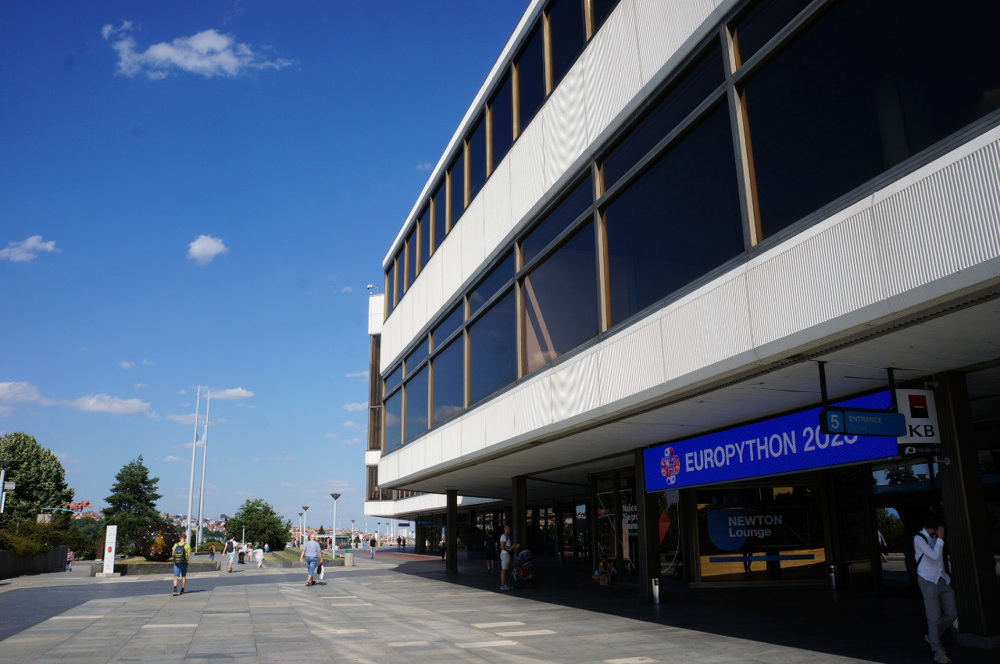

import { Image } from "astro:assets";

import venueImage from "./images/prague.jpg";

# Where

  EuroPython 2024 will be held in **Prague**! We cannot wait to welcome you in
  one of the most beautiful cities in Europe!

## Prague

<Image src={venueImage} width="1200" alt="" />

  

Prague is the capital of the Czech Republic. Sitting on the [Vltava River](https://www.youtube.com/watch?v=l6kqu2mk-Kw), the beautiful historic centre is a UNESCO world heritage site. There's a LOT to see, do and enjoy, in addition to the conference! The ancient [Vyšehrad](https://www.vysehradtickets.com/vysehrad/) is just 10-min walk away from the conference venue. Not only is is an ancient fortress, but also a park with a great view of Prague Castle and the river. We hope you enjoy taking a walk with fellow Pythonistas in the tranquil park when you need a bit of peace from the buzz of the conference.

As per EuroPython tradition, we shall walk around, chat, laugh and explore the city together. Whether it is to enjoy the stunning view of the "[City of a Hundred Spires](https://www.prague.eu/en/articles/the-towers-of-prague-10537)" from any (or all!) of the 120+ towers, or standing still to admire the wonder of [Prague Astronomical Clock](https://www.prague.eu/en/object/places/3129/astronomical-clock?back=1). The only problem is being spoiled for choice!

In addition, Prague has an extensive and modern public transport system; its [public transport website](https://www.dpp.cz/en) will give you all the information you need.

Check out the following resources for some guides to the city:

- [Prague.eu](https://www.prague.eu/en)

- [Timeout](https://www.timeout.com/prague)

- [My Prague - Insiders' Guide to the City (with audio)](https://english.radio.cz/node/8702571/o-poradu)

- [Honest Guide (videos)](https://www.youtube.com/@HONESTGUIDE)

- [USEIT Prague Map](https://www.use-it.travel/cities/detail/prague/)

- [Prague Tourist Information](https://praguetouristinformation.com/en/)

- [Prague.org](https://prague.org/)

### Weather

With an average July high of 25°C, remember to pack your shorts and sandals with your laptop, along with a spirit of adventure to explore one of the most visited and vibrant cities in Europe. Friendly reminder: it might get up to mid 30°C in July🥵 - we recommend packing sunscreen and regular hydration to avoid excessive burning.

## Prague Congress Centre - Conference Venue

[The Prague Congress Centre](https://www.praguecc.cz/en/homepage) is the home of
EuroPython in 2024 between 8-14 July.

It's an important venue, having hosted the IMF, NATO and other significant and
powerful international organisations. Now they can add EuroPython to that list! 😛

The conference centre is adjacent to the Vyšehrad - a short walk away from [Náplavka](https://www.mmzoneblog.com/naplavka), full of cafes, pubs and restaurants, a wonderful area to relax by the river and take in the spirit of the city.

The Vyšehrad station next to the venue on Line C of the Prague underground railway network, also provides convenient
access by public transport from the city’s airport and all major rail and bus stations.

<Map></Map>

<address>
**Entrance 5**

Kongresové centrum Praha, a.s. 
140 00 Prague 4, Czechia 

</address>

### Get to the Conference

**IMPORTANT: use Entrance 5 of the building to get into the conference.**

You can find detailed information on how to get to the conference centre
[via the venue's website](https://www.praguecc.cz/en/how-to-get-here) or
with their
[convenient orientation guide (PDF)](https://www.praguecc.cz/users_data/files/ORIENTATION_PLANS_orientacni_pla.pdf).

## Sprints Venue

Will be announced later.

## Getting Around in Prague

- **By public transport**: plan your route and check the fares using the [Prague Public Transport website](https://www.dpp.cz/en). On your phone you can install the [Lítačka app](https://app.pidlitacka.cz/) for public transport navigation as well as purchasing tickets.

- **Planes**: [Prague's Václav Havel Airport (PRG)](https://www.prg.aero/en) is well connected
  to the conference and sprints venue via the public transport system.

- **Trains**: please refer to the [Czech Railways (České dráhy)](https://www.cd.cz/en/) website for timetables, bookings and ticket prices.

## COVID Info

For any COVID related information in Prague, please refer to our dedicated
[COVID Info section on our FAQ Page](/faq#covid-related-questions) and the Czech Government's [COVID information portal](https://covid.gov.cz/en/).
