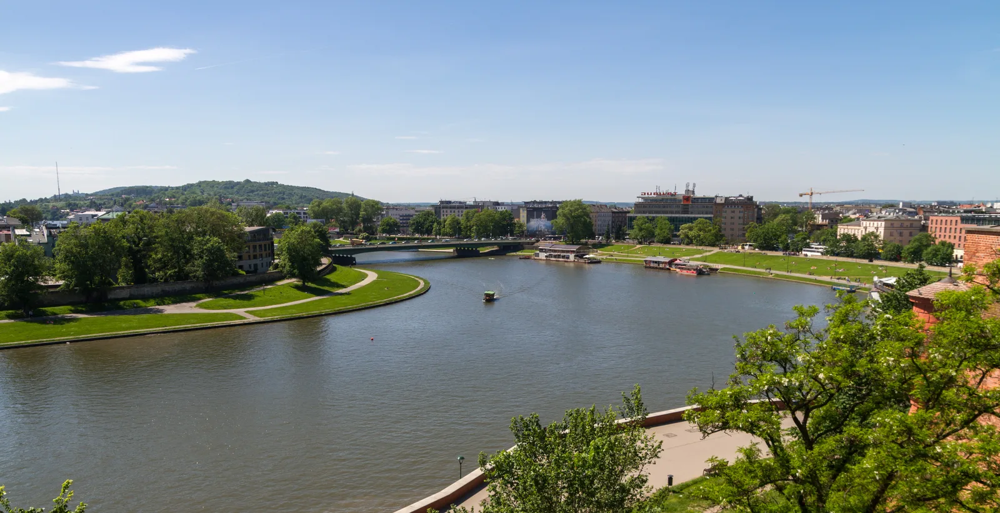

# Women in Python 5k Run 🏃‍♀️

Start your conference day with some fresh air, movement, and good company! This
is a relaxed, friendly 5k run along the river - about community and fun, not
competition. Whether you are an experienced runner, a casual jogger, or simply
looking for a nice way to begin the morning, you are warmly welcome.

_Photo: [Maksym Kozlenko](https://commons.wikimedia.org/wiki/File:2017-05-29_Vistula_in_Krak%C3%B3w.jpg), [CC BY-SA 4.0](https://creativecommons.org/licenses/by-sa/4.0/), via Wikimedia Commons._

## Who is it for?

It is a chance to meet fellow women in the Python community, enjoy the city, and
get moving before the talks begin. All paces are welcome, whether you run, jog,
or walk.

## When & Where?

- 🗓 **When:** Thursday morning, starting at 7:00
- 📍 **Where:** Along the Wisła (Vistula) riverside boulevards
- 🏃 **Route:** A 2.5 km out-and-back along the river, 5 km in total.
  [See the route](https://mapy.com/s/fefajesolu)
- 💸 **Cost:** Free, for in-person ticket holders only
- 🎟️ **Spaces:** Limited to just 20 runners on a first-come, first-served basis,
  so register as soon as you receive your voucher

## Tickets

All on-site conference ticket holders will receive a voucher to sign up for the
run. Be sure to claim your spot early, as there are only 20 available.

## Big thanks to our sponsor!

This run is proudly sponsored by Arm - thank you for helping keep the Python
community moving!

<LinkedSponsor sponsor="arm" mode="button">Visit our sponsor Arm</LinkedSponsor>
